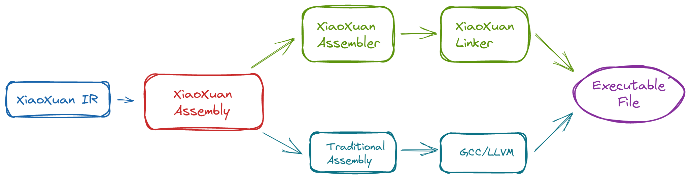

# XiaoXuan Assembly - RISC-V

一个易于人类阅读和书写的汇编语言 —— RISC-V 版。

An assembly language that is easy to read and write - RISC-V edition.

## XiaoXuan Family

TODO::

## Motivation

传统的汇编语言虽然简洁，但往往难以阅读，对于初学者不友好，写内联汇编时也比较困难。

比如有些指令的缩写太过于简短而导致容易混淆，又比如有些具有多个操作数的指令，我们很难从文本中推断出操作数之间的关系，甚至同时存在不同阅读方向的主流汇编语言。

_小萱汇编语言_ 试图从这些方面解决这些问题：

* 使用函数的形式表示指令；
* 重新命名指令的名称，平衡简洁性和可阅读性；
* 结构化流程控制的指令块；
* 结构化汇编文本；

本项目除了定义了一个汇编语言，同时还实现了一个 _汇编器_，在某些要求简单的场合下可以使用这个工具连同 XiaoXuan Linker 来代替 GCC 或者 LLVM 的汇编和链接工作。

### 汇编文本示例

TODO::

## How it works?

_汇编器_ 首先把结构化的 XiaoXuan Assembly 文本转为平铺的指令序列，然后把各个指令翻译成相应的机器代码得到目标文件；XiaoXuan Linker（一个 _链接器_）再根据链接脚本将一个或多个目标文件链接起来，形成 ELF 格式的可执行文件。

> _汇编器_ 也能将 XiaoXuan Assembly 转换为传统的汇编文本，然后让 GCC 或者 LLVM 汇编成目标文件。

## Usage

TODO::

## Donation

_Hemashushu_ believes that everyone should be able to easily learn and use modern computer technology, for which the author has created a series of software and tutorials covering the entire computer system, starting from basic electronic circuits to cutting-edge technologies.
The content is open source and free. If you find the content helpful, please consider donating to sponsor the author, and thank you for your support!

## 捐赠

河马蜀黍认为每个人都应该能轻松地学会并使用现代的计算机技术，为此作者创作了一系列的软件和教程，内容从基本的电子电路开始到前沿技术，涵盖整个计算机体系。
这些内容都是开源免费的，如果你觉得这些内容对你有帮助，请考虑捐赠赞助作者，感谢你的支持！
