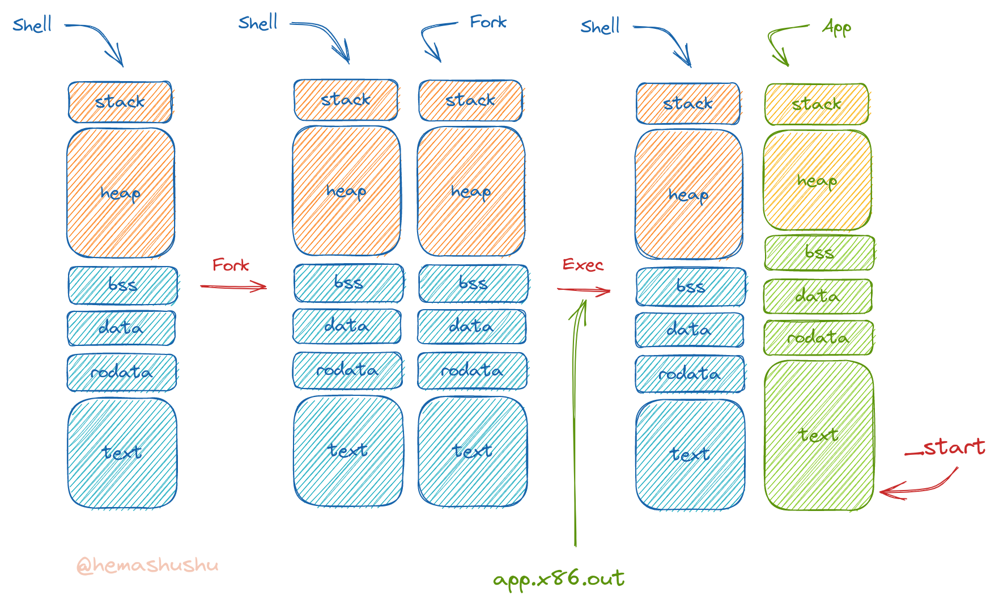
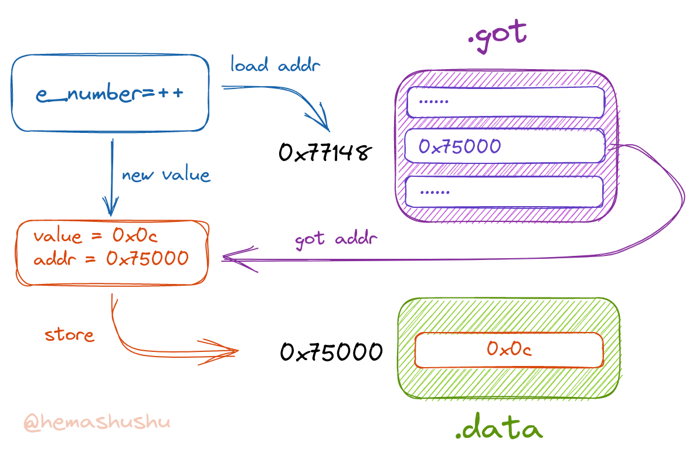
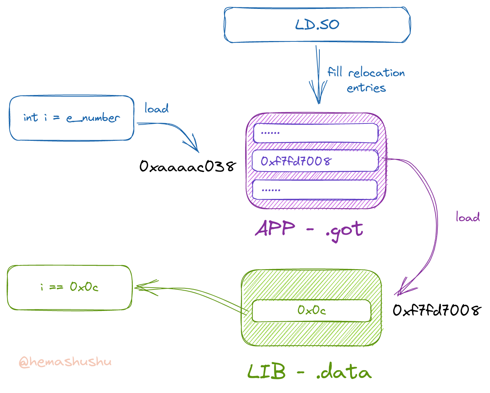
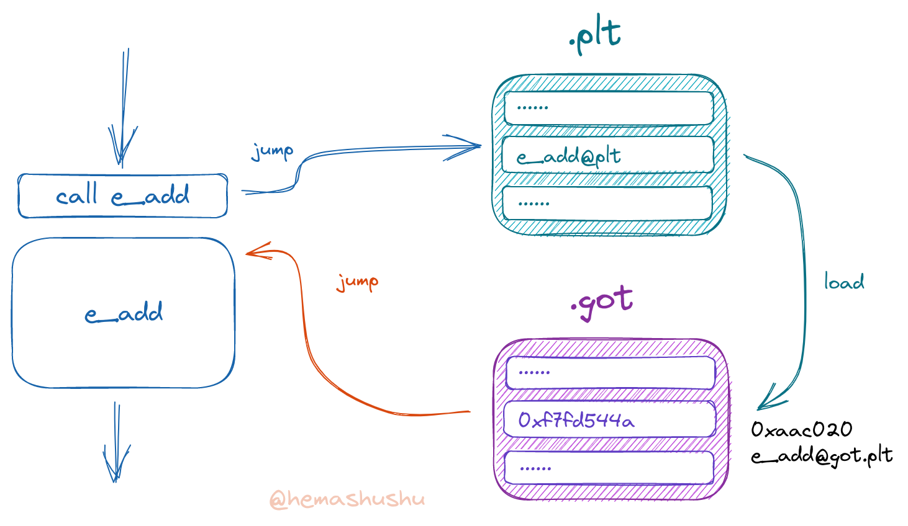

# 动态链接的原理

下面从程序的外部以及内部两个角度来分析动态链接的实现原理。

<!-- @import "[TOC]" {cmd="toc" depthFrom=2 depthTo=6 orderedList=false} -->

<!-- code_chunk_output -->

- [动态链接](#动态链接)
  - [生成共享库](#生成共享库)
  - [使用共享库](#使用共享库)
- [程序的加载](#程序的加载)
- [访问外部变量和函数](#访问外部变量和函数)
- [静态链接的详细过程](#静态链接的详细过程)
  - [编译](#编译)
    - [程序 `app.ext.c`](#程序-appextc)
    - [静态库 `libext.c`](#静态库-libextc)
    - [链接与运行](#链接与运行)
  - [全局变量的访问](#全局变量的访问)
  - [外部函数的调用](#外部函数的调用)
  - [动态分析](#动态分析)
- [动态链接的详细过程](#动态链接的详细过程)
  - [全局变量的访问](#全局变量的访问-1)
  - [动态分析全局变量的访问](#动态分析全局变量的访问)
  - [运行时动态链接器](#运行时动态链接器)
  - [外部函数的调用](#外部函数的调用-1)

<!-- /code_chunk_output -->

这篇文章将会在一个 RISC-V Linux 环境中 _本地编译_ 程序以及分析程序的

假设我们的开发平台是 x86 Linux（或者 ARM），为了方便 XiaoXuan Assembly 的测试和验证，需要安装虚拟机 [QEMU](https://www.qemu.org/) 以及编译工具 [RISC-V GCC](https://github.com/riscv-collab/riscv-gnu-toolchain)。开发者在 Linux 环境里只需使用各发行版自己的 _包管理器_ 来安装这两个软件即可。比如在 Arch Linux 里，安装下面几个包：

- `qemu-system-riscv`
- `riscv64-elf-binutils`
- `riscv64-elf-gcc`
- `riscv64-elf-gdb`

下面章节将会简单介绍汇编和链接的大概原理，以及相关软件的基本使用方法。

## 动态链接

平常我们会把通用的库做成 _共享库_（也叫 _动态库_，或者 _动态共享目标文件_ 即 DSO），让应用程序在运行阶段 "动态" 地找到我们的库然后调用其中的函数。在编译应用程序时，如果准备采用共享库的工作方式，则可以称该应用程序用了动态链接技术。

动态链接有几个主要的优点：

1. 对比静态链接，使用动态链接可以减小可执行文件的容量。想象一下如果有一个极为通用的函数库，如果使用静态链接的话，则每个应用程序都需要复制一遍它使用到的函数的代码。而使用动态链接的话，应用程序只需指明需要的库的名称和函数名即可。

2. 可以解耦应用程序和共享库。如果在发布应用程序后发现库里面有 bug，我们可以只修复和重新发布该库即可，而不需要重新编译和发布应用程序。

3. 能加速应用程序的加载速度和减少内存使用量。如果有多个应用程序都使用到同一个共享库，则操作系统在运行这些应用程序时，只需加载一次共享库即可。

当然动态链接也有不少缺点，比如在 Linux 环境里，因为动态库的路径问题而导致应用程序运行失败的例子比比皆是，在这里我们不深入探讨。不过动态链接是非常常用的技术，所以我们还是有必要了解如何生成和使用动态库，以及它的工作原理。

因为 RISC-V GCC 在交叉链接共享库，以及使用 _用户模式_ 的 QEMU 运行动态链接程序时支持得不太稳定，所以下面的内容是在一台 RISC-V QEMU Linux 虚拟机里操作的（具体来说，这台虚拟机的 CPU 是 RISC-V，操作系统是 Debian），有关如何安装、配置和运行 RISC-V QEMU Linux 虚拟机，请参阅本项目的另外一篇文章 [RISC-V QEMU 的使用和调试](../risc-v-qemu-and-debug/README.zh-Hans.md)。

> 如果不想安装配置 RISC-V QEMU Linux 虚拟机，下面的内容也可以本地 GCC （也就是 x86_64 或者 ARM GCC）下操作，虽然本地的指令集跟 RISC-V 不太一样，但基本思路是相通的。

### 生成共享库

跟上一节的例子相似，这次的程序由 `liba.c`，`libb.c` 以及 `app.dyn.c` 组成（文件名里的 `.dyn` 仅用于区分之前生成的目标文件，并没有特殊的作用），另外还有头文件 `a.h`，`b.h` 和 `math.h`。

生成共享库的方法跟生成静态库（包文件）有些类似，不过使用的是 `gcc` 程序而不是 `ar`，下面的命令用于将 `liba.c` 和 `libb.c` 生成 `libmath.so`：

`$ gcc -shared -fPIC -Wl,-soname,libmath.so.1 -o libmath.so.1.0.1 libb.c liba.c`

参数：

- `-shared` 表示生成共享库而不是可执行文件。
- `-Wl,-soname,libmath.so.1` 是一个用逗号拼接的用于传递给链接器的参数，相当于 `$ ld -soname libmath.so.1 ...`，链接器参数 `-soname` 用于指定[共享库的逻辑名称](https://en.wikipedia.org/wiki/Soname)。`soname` 用于程序运行时链接。
- `-o libmath.so.1.0.1` 指定输出的文件名。一般来说，共享库的文件名会包含版本号。

命令运行完成后我们得到共享库文件 `libmath.so.1.0.1`，

> 注意，从这一节开始我们是在 RISC-V Linux 虚拟机里操作的，所以现在是本地编译，而不是交叉编译了。使用的 GCC 工具也就没有诸如 `riscv64-elf-*` 之类的前缀了。

我们先查看一下文件格式：

`$ file libmath.so.1.0.1`

输出结果如下：

```text
libmath.so.1.0.1: ELF 64-bit LSB shared object, UCB RISC-V, RVC, double-float ABI, version 1 (SYSV), dynamically linked, BuildID[sha1]=7985b821db23365373794a1c2c18511e185a8296, not stripped
```

如果你的输出结果看不到 `RISC-V` 字样，很有可能是因为你错误地在本机上编译，而不是在虚拟机里。有时同时打开多个虚拟终端窗口是很容易混淆的，请确保是在虚拟机里操作再继续。

从上面的输出结果可见，共享库文件也是一个 ELF 格式文件。

然后检查它的 soname：

`$ readelf -d libmath.so.1.0.1`

输出的结果如下：

```text
Dynamic section at offset 0xe90 contains 19 entries:
  Tag        Type                         Name/Value
 0x000000000000000e (SONAME)             Library soname: [libmath.so.1]
```

可见 soname 的值为 `libmath.so.1`。

下面查看它的符号表：

`$ nm libmath.so.1.0.1`

输出的（部分）结果如下：

```text
...
00000000000004b0 T add
000000000000048a T add10
```

可见 `liba` 和 `libb` 里面的两个函数都被包含进去了。

进一步使用 `readelf` 查看段的情况：

`$ readelf -l libmath.so.1.0.1`

输出的（部分）结果为：

```text
Elf file type is DYN (Shared object file)
Entry point 0x0
There are 7 program headers, starting at offset 64

Program Headers:
  Type           Offset             VirtAddr           PhysAddr
                 FileSiz            MemSiz              Flags  Align
  ...
  LOAD           0x0000000000000000 0x0000000000000000 0x0000000000000000
                 0x00000000000004e0 0x00000000000004e0  R E    0x1000
  LOAD           0x0000000000000e80 0x0000000000001e80 0x0000000000001e80
                 0x00000000000001c0 0x00000000000001c8  RW     0x1000
  DYNAMIC        0x0000000000000e90 0x0000000000001e90 0x0000000000001e90
                 0x0000000000000170 0x0000000000000170  RW     0x8

 Section to Segment mapping:
  Segment Sections...
   ...
   01     .note.gnu.build-id .gnu.hash .dynsym .dynstr .rela.dyn .rela.plt .plt .text .eh_frame
   02     .init_array .fini_array .dynamic .data .got .bss
   03     .dynamic
```

可见目标文件、可执行文件、共享库文件其实都是 ELF 格式，且具有相同的结构，只是使用的目的不同。

另外第二行信息：`Entry point 0x0` 表明共享库跟可执行文件有一个比较明显的不同之处：共享库没有入口。共享库由一堆函数和数据组成，仅供程序调用，它自己因为没有入口所以无法单独运行。

### 使用共享库

程序 `app.dyn.c` 的源码如下：

```c
#include <stdio.h>
#include "math.h"

int main()
{
    int a = 3;
    int b = 5;
    int m = add(a, b);
    int n = add10(a);

    printf("Hello world!\n");
    printf("m=%d\n", m);
    printf("n=%d\n", n);
}
```

程序非常简单，只是简单地调用 `add` 和 `add10` 两个函数，下面我们使用动态链接的方法生成可执行文件 `app.dyn.out`：

`$ gcc -Wall -o app.dyn.out app.dyn.c libmath.so.1.0.1`

上面的命令把 `libmath.so.1.0.1` 作为输入文件列表的其中一员，这种写法跟静态链接类似。但更常见写法的如下：

`$ gcc -Wall -o app.dyn.out app.dyn.o -L . -l math`

参数：

- `-L .` 表示将当前目录也作为 `LD_LIBRARY_PATH` 的一部分，环境变量 `LD_LIBRARY_PATH` 是一个用冒号分隔的一系列路径（形式跟环境变量 `PATH` 一样），用于指示链接器从这些位置搜索链接所需的共享库（是不是跟 Java 当中的 `CLASSPATH` 有点相像？），你可以反复传入多个 `-L ???` 参数用于指定多个路径。
- `-l math` 表示我们的程序会使用到链接名称（linker name）为 `math` 这个库，而链接器将会在链接名称加上前缀 `lib` 和后缀 `.so` 得到文件名（real name）`libmath.so`，然后在 `LD_LIBRARY_PATH` 里搜索匹配的文件。

一般来说我们需要手动创建一个符号链接才能成功编译，不过有些编译器却很智能地推导出共享库的文件名，如果编译失败，则运行下面命令再次编译：

`$ ln -s libmath.so.1.0.1 libmath.so`

> 注意，在编译的链接阶段，`-l name` 使用的是共享库的 `linker name`，而不是 `soname`（当前例子的 soname 的值为 `libmath.so.1`），也不是共享库文件名本身（也叫 `real name`）。`linker name` 仅在编译链接程序时使用，而 `soname` 仅在运行时动态链接使用。

程序运行完成之后得到可执行文件 `app.dyn.out`，下面运行这个文件：

`$ app.dyn.out`

可惜程序并没有像预料那种顺利运行，它会报告错误：

```text
./app.dyn.out: error while loading shared libraries: libmath.so.1: cannot open shared object file: No such file or directory
```

消息提示找不到一个 `soname` 为 `libmath.so.1` 的共享库，你可能会很惊讶，这个文件不正躺在文件 `app.dyn.out` 的旁边吗？对于有使用 Windows 系统经验的人来说可能更惊讶，在 Windows 里只需把缺少的 DLL 文件复制到跟 EXE 文件同一个目录里就能简单解决找不到共享库的问题。

然而 Linux 系统并不会从可执行文件所在的目录，或者某个叫 `lib` 的子目录里搜索共享库文件，它只会搜索默认的路径 `/usr/lib` 以及在 `/etc/ld.so.conf`（或者 `/etc/ld.so.conf.d/*.conf`）列出的目录。可以使用 `ldd` 命令检查一个可执行文件依赖哪些共享库：

`$ ldd app.dyn.out`

输出的结果如下：

```text
        linux-vdso.so.1 (0x00ffffff7f8d0000)
        libmath.so.1 => not found
        libc.so.6 => /lib/riscv64-linux-gnu/libc.so.6 (0x00ffffff7f792000)
        /lib/ld-linux-riscv64-lp64d.so.1 (0x00ffffff7f8d2000)
```

可以看到其中有一行写着 `libmath.so.1 => not found`。

> 如果你反复运行 `ldd` 命令，会发现括号里面的地址（比如 `0x00ffffff7f792000`）会随机改变的，这是 Linux 的一种安全机制，每次加载共享库的内存地址都是随机的，这种技术叫 [ASLR](https://en.wikipedia.org/wiki/Address_space_layout_randomization)。

为了让 `app.dyn.out` 能成功运行，可以把共享库文件 `libmath.so.1.0.1` 复制到 `/usr/lib` 或者 `/usr/local/bin`：

`$ sudo cp libmath.so.1.0.1 /usr/local/lib`

然后刷新共享库路径的缓存：

`$ sudo ldconfig`

上面的第一条命令是将我们的共享库路径加入到 `/etc/ld.so.conf.d/mylib.conf`，。 -->

我们可以检查一下是否起效了：

`$ ldconfig -p|grep libmath`

如无意外，应该能看到如下结果：

```text
        libmath.so.1 (ELF,double-float) => /usr/local/lib/libmath.so.1
```

运行 `ldconfig` 之后，会看到在同一个目录中（`/usr/local/lib`）新出现了一个符号链接 `libmath.so.1`，该链接指向共享库文件 `libmath.so`。

`$ ls -l /usr/local/lib/`

输出的结果如下：

```text
total 8
lrwxrwxrwx 1 root root   16 Oct 13 21:45 libmath.so.1 -> libmath.so.1.0.1
-rwxr-xr-x 1 root root 7192 Oct 13 21:44 libmath.so.1.0.1
```

接下来我们再尝试运行程序 `app.dyn.out`：

`$ ./app.dyn.out`

输出结果如下：

```text
Hello world!
m=8
n=13
```

再次使用 `ldd` 检查程序的共享库：

`$ ldd app.dyn.out`

输出的结果如下：

```text
        linux-vdso.so.1 (0x00ffffffb5e9f000)
        libmath.so.1 => /usr/local/lib/libmath.so.1 (0x00ffffffb5e95000)
        libc.so.6 => /lib/riscv64-linux-gnu/libc.so.6 (0x00ffffffb5d5e000)
        /lib/ld-linux-riscv64-lp64d.so.1 (0x00ffffffb5ea1000)
```

> 有些系统并未把 `/usr/local/lib` 作为预设的共享库路径，如果此方法行不同，请看接下来的章节。

除了把共享库文件复制到诸如 `/usr/lib` 或 `/usr/local/lib` 等目录，也可以把共享库所在的目录加入到 `/etc/ld.so.conf`：

```bash
$ echo `pwd` | sudo tee /etc/ld.so.conf.d/mylib.conf > /dev/null
```

然后刷新缓存，也能达到相同的效果。

> 记得做完实验之后要删除文件 `/usr/local/lib/libmath.so*`，`/etc/ld.so.conf.d/mylib.conf` 并且执行 `ldconfig` 命令以刷新共享库路径的缓存，保持系统干净整洁是良好的习惯。

不过有时我们仅想测试一下程序，或者不希望更改系统的配置（比如复制文件到 `/usr/local/lib` 或者修改 `/etc/ld.so.conf`），还可以通过设置环境变量 `LD_LIBRARY_PATH` 来让程序顺利运行：

`$ LD_LIBRARY_PATH=. ./app.dyn.out`

> 其实还有一种使用共享库的方法，就是把共享库文件的路径硬编码到可执行文件里（通过参数 `-rpath /dir/to/library` 传递共享库所在的目录给链接器），不过这样的可执行文件如果拿给你的朋友，我担心你会被朋友揍，所以这里就不展开讲了。

最后，可能你会好奇，能不能让共享库以静态链接的方式链接到可执行文件里面呢？也就是把动态库 `*.so` 当成静态库 `*.a` 来使用。让我们测试一下吧：

`$ gcc -Wall -static -o app.dyn.static.out app.dyn.c libmath.so.1.0.1`

在命令中加入了 `-static` 参数，输出的结果如下：

```text
/usr/bin/ld: attempted static link of dynamic object `libmath.so'
collect2: error: ld returned 1 exit status
```

显然是行不通的。


## 程序的加载

首先看看操作系统是如何加载和运行一个应用程序：

1. 在 shell 里输入 `./app.dyn.out` 并回车；
2. shell 发现这个文件有 "execute" 权限，于是开始一系列 "运行" 它的操作；
3. 调用 `fork` 系统调用复制了一个跟自己一样的进程。这里说的 "一样" 是指包括内存的数据、文件描述符表等等都一样，仅进程 id 不同。

   这里可能很多人会有疑问，这样复制一份数据会不会很耗时间和资源？实际上现代的操作系统都用了 _虚拟内存_ 管理技术，所以复制一个进程的内存空间时，并不是真的一个字节一个字节地复制。简单地说，真正复制的只有内存页面的位置，仅当内存页的内容发生写入操作时才真的复制一份数据，（有关多级内存页表、虚拟内存管理的原理和实现可以参阅 XiaoXuan OS 项目的文档）。总的来说 `fork` 的过程很快，也不太占系统资源。



4. 被克隆出来的进程发现自己是子进程，然后调用 `exec` 系统调用。这时操作系统（严格来说叫内核）会加载目标可执行文件进内存，并且替换掉内存当中原先进程（父进程）的 `.text`、`.rodata`、`.data` 和 `.bss` 等内容。

   注意内核并不会把整个可执行文件的内容都加载进内存，而是根据 ELF 的 program header 来加载部分的段（还记得 `readelf` 可以查看段的 LOAD 标记吗？）。有时可执行文件的体积可能很巨大，但因为使用了内存映射技术，可执行文件的内容并不会真的从磁盘（或者 SSD）一个字节一个字节地复制进内存，仅当被读到的部分才会加载，所以跟 `fork` 过程类似，`exec` 的过程也是很快的。

5. 如果可执行文件是静态链接的，那么内核就会把控制权交给应用程序，也就是以用户模式（CPU 一般会分为 _机器模式_、_Supervisor 模式_ 和 _用户模式_ 等几种不同能力的运行模式）执行程序 `_start` 位置的第一个指令。

如果可执行文件是动态链接的，那么还会有额外的一段加载过程：

1. 内核加载动态加载器（`ld.so`），然后把控制权交给它。

> 动态加载器可以理解为 "运行时动态链接器"，相对地，`ld` 程序可以理解为 "编译时静态链接器"。

2. 动态加载器查看应用程序依赖哪些共享库，然后根据 `ld.so.conf` 提供的列表搜索这些共享库，并把共享库文件加载进内存（注意这里也是虚拟内存，所以相同的共享库其实只加载了一次）。

如果想查看详细的加载过程，可以运行 `$ LD_LIBRARY_PATH=. LD_DEBUG=all /lib/ld-linux-riscv64-lp64d.so.1 ./app.dyn.out`，因为输出的结果非常长，这里就省略了。

3. 动态加载器将控制权交给应用程序，也就执行程序 `_start` 位置的第一个指令（还需要经过一翻初始化之后才到我们手写的 `main` 函数）。

## 访问外部变量和函数

由上一节可知，共享库文件跟可执行文件有相同的结构，我们甚至可以把它们理解是 "缺少 `_start` 过程" 的可执行文件，也就是说共享库也有自己的 `.text` 和 `.data` 等段。现在应用程序和它所依赖的所有共享库都被加载进同一个内存空间，那么在应用程序里访问外部变量其实就是访问指定内存地址，调用外部函数（即共享库里面的函数）实质上只是把 PC/IP（程序计数器/指令指针）跳转到目标函数所在的内存地址而已。

不过这里有一个问题，就是共享库加载到内存的位置并不是一成不变的（ASRL），而且共享库也可能会因为版本更新而导致函数的地址不同，所以编译器（链接器）没办法将外部变量、外部函数的地址写死（将会因环境变化而改变的值写到源代码里，这种行为叫硬编码，漫长的历史告诉我们应该尽量避免硬编码，实在无法避免时也应尽量减少硬编码的数量）在可执行文件的代码里。


为了解耦应用程序和共享库，应用程序应该只记录外部变量和函数的名称、以及它所在的共享库的名称。在读写外部变量或者在调用这些函数时，先从共享库的导出符号表里搜索相应的变量或者函数，然后再读写或者跳转到它所在的地址。但如果每次访问外部变量或函数都搜索一次地址，效率就太低了。因此应用程序在运行时有两个表用于加速访问外部变量和函数：

- GOT（global offset table），用于记录外部变量和函数的地址
- PLT（procedure linkage table），一组跟外部函数同名的函数，每个函数的内容都是相同的：从 GOT 加载外部函数的真实地址，然后跳转过去。所以 PLT 只是一堆跳转到外部函数的跳板函数。

下面通过实例讲解这两个表的工作原理。现在有程序 `app.ext.c` （文件名中的 `.ext` 仅为了区分之前生成的目标文件，并没有特殊的作用）和库 `libext.c`，其源代码如下：

```c
// app.ext.c
extern int e_number;
int e_add(int);

int test_get_number()
{
    return e_number;
}

int test_set_number()
{
    e_number++;
    return e_number;
}

int test_add(int a)
{
    return e_add(a);
}

int test_add_twice(int a)
{
    return e_add(a) + e_add(a);
}

int main()
{
    int m = test_get_number();
    int n = test_set_number();
    int x = test_add(10);
    int y = test_add_twice(30);
    return m + n + x + y;
}

// libext.c
static int e_number = 11;

int e_add(int a)
{
    return e_number + a;
}
```

如上所见，库的功能非常简单，里面有一个全局变量 `e_number` 和一个函数 `e_add`，函数的作用是让传入的参数和 `e_number` 相加，然后返回计算的结果。而程序只是简单地访问这个全局变量和调用函数。

## 静态链接的详细过程

下面尝试以静态链接的方式生成程序，以此了解链接器实现 `重定位` 的详细过程。

### 编译

下面分别编译程序和静态库。

#### 程序 `app.ext.c`

`$ gcc -Wall -g -fPIC -c -o app.ext.o app.ext.c`

得到目标文件 `app.ext.o`，根据前面的章节我们知道程序里所有涉及函数的调用、全局变量的访问，其地址都是 `0`，仅当链接的时候才会被填充真实的地址（这个过程叫 _重定位_）。目标文件里有一个表记录着所有需要重定位的符号名称及其地址，可以用下面的命令查看：

`$ readelf -r app.ext.o`

输出的结果当中 `.rela.text` 段的内容如下：

```text
Relocation section '.rela.text' at offset 0x10e0 contains 26 entries:
  Offset          Info           Type           Sym. Value    Sym. Name + Addend
000000000006  005900000014 R_RISCV_GOT_HI20  0000000000000000 e_number + 0
00000000000a  003800000018 R_RISCV_PCREL_LO1 0000000000000006 .L0  + 0
00000000000a  000000000033 R_RISCV_RELAX                        0
00000000001e  005900000014 R_RISCV_GOT_HI20  0000000000000000 e_number + 0
000000000022  003900000018 R_RISCV_PCREL_LO1 000000000000001e .L0  + 0
000000000022  000000000033 R_RISCV_RELAX                        0
00000000002e  005900000014 R_RISCV_GOT_HI20  0000000000000000 e_number + 0
000000000032  003a00000018 R_RISCV_PCREL_LO1 000000000000002e .L0  + 0
000000000032  000000000033 R_RISCV_RELAX                        0
000000000038  005900000014 R_RISCV_GOT_HI20  0000000000000000 e_number + 0
00000000003c  003b00000018 R_RISCV_PCREL_LO1 0000000000000038 .L0  + 0
00000000003c  000000000033 R_RISCV_RELAX                        0
00000000005e  005c00000013 R_RISCV_CALL_PLT  0000000000000000 e_add + 0
00000000005e  000000000033 R_RISCV_RELAX                        0
000000000088  005c00000013 R_RISCV_CALL_PLT  0000000000000000 e_add + 0
000000000088  000000000033 R_RISCV_RELAX                        0
00000000009a  005c00000013 R_RISCV_CALL_PLT  0000000000000000 e_add + 0
00000000009a  000000000033 R_RISCV_RELAX                        0
0000000000bc  005800000013 R_RISCV_CALL_PLT  0000000000000000 test_get_number + 0
0000000000bc  000000000033 R_RISCV_RELAX                        0
0000000000ca  005a00000013 R_RISCV_CALL_PLT  0000000000000018 test_set_number + 0
0000000000ca  000000000033 R_RISCV_RELAX                        0
0000000000da  005b00000013 R_RISCV_CALL_PLT  000000000000004a test_add + 0
0000000000da  000000000033 R_RISCV_RELAX                        0
0000000000ea  005d00000013 R_RISCV_CALL_PLT  0000000000000072 test_add_twice + 0
0000000000ea  000000000033 R_RISCV_RELAX                   0
```

> 使用 `objdump -r app.ext.o` 也能实现同样的目的，正如[上一章](../tesing-env-setup/README.zh-Hans.md)所说，GCC 工具里有很多程序都会提供类似的功能，你只需按照自己的喜好和习惯选择即可。

从上面的结果可知，代码当中位置 `0x000000000006` 需要重定位为符号 `e_number` 的真实地址，而位置 `0x00000000005e` 需要重定位为符号 `e_add` 的实际地址。另外还可以看到文件自身就已存在的函数 `test_get_number`，`test_set_number`，`test_add_twice` 和 `test_add`，正如前面所说，虽然现阶段就已经知道它们的地址，不过在链接阶段之前，通通都用 `0` 占位。

然后挑选两个位置 `0x000000000006` 和 `0x00000000005e` 查看它们的内容：

`$ objdump -d -S app.ext.o`

> 参数 `-S` 可以让反汇编的结果跟源代码（C 语言的代码）混合显示，这样可以方便我们阅读和理解汇编文本。

输出的（部分）结果如下：

```text
0000000000000000 <test_get_number>:
int test_get_number()
{
   0:   1141                    addi    sp,sp,-16
   2:   e422                    sd      s0,8(sp)
   4:   0800                    addi    s0,sp,16
    return e_number;
   6:   00000797                auipc   a5,0x0
   a:   0007b783                ld      a5,0(a5) # 6 <test_get_number+0x6>
   e:   439c                    lw      a5,0(a5)
...
0000000000000018 <test_set_number>:
int test_set_number()
{
...
    e_number++;
  1e:   00000797                auipc   a5,0x0
  22:   0007b783                ld      a5,0(a5) # 1e <test_set_number+0x6>
  26:   439c                    lw      a5,0(a5)
  28:   2785                    addiw   a5,a5,1
  2a:   0007871b                sext.w  a4,a5
  2e:   00000797                auipc   a5,0x0
  32:   0007b783                ld      a5,0(a5) # 2e <test_set_number+0x16>
  36:   c398                    sw      a4,0(a5)
    return e_number;
  38:   00000797                auipc   a5,0x0
  3c:   0007b783                ld      a5,0(a5) # 38 <test_set_number+0x20>
  40:   439c                    lw      a5,0(a5)
...
000000000000004a <test_add>:
int test_add(int a)
{
...
    return e_add(a);
  58:   fec42783                lw      a5,-20(s0)
  5c:   853e                    mv      a0,a5
  5e:   00000097                auipc   ra,0x0
  62:   000080e7                jalr    ra # 5e <test_add+0x14>
  66:   87aa                    mv      a5,a0
...
0000000000000072 <test_add_twice>:
int test_add_twice(int a)
{
...
    return e_add(a) + e_add(a);
  82:   fdc42783                lw      a5,-36(s0)
  86:   853e                    mv      a0,a5
  88:   00000097                auipc   ra,0x0
  8c:   000080e7                jalr    ra # 88 <test_add_twice+0x16>
  90:   87aa                    mv      a5,a0
  92:   84be                    mv      s1,a5
  94:   fdc42783                lw      a5,-36(s0)
  98:   853e                    mv      a0,a5
  9a:   00000097                auipc   ra,0x0
  9e:   000080e7                jalr    ra # 9a <test_add_twice+0x28>
  a2:   87aa                    mv      a5,a0
  a4:   9fa5                    addw    a5,a5,s1
  a6:   2781                    sext.w  a5,a5
```

- 位置 `0x06` 是占位符数字 `0`，用于构造寄存器 `a5` 的值，然后通过指令 `ld` 读取它指向位置的内容。
- 位置 `0x5e` 也是占位符数字 `0`，用于构造寄存器 `ra` 的值，然后下一个指令即将跳到它指向的位置。

由此可见，在 _重定位_ 列表当中，所有 `Offset` 指向的位置都是数字 `0`，作用都是（通过 `auipc` 指令）构建目标位置的地址。

#### 静态库 `libext.c`

`$ gcc -Wall -g -fPIC -c -o libext.o libext.c`

然后查看导出的符号及其位置：

`$ nm libext.o`

输出的结果如下：

```text
0000000000000000 T e_add
0000000000000000 D e_number
```

> 使用 `$ objdump -t libext.o` 或者 `$ readelf -s libext.o` 也能查看符号列表。

注意上面两个符号的地址都是 `0`，这是因为它是静态库，相关的数据会被复制到最终目标文件，位置仅跟它们在目标文件所处的位置有关。而现在它自身还处于 _目标文件_ 状态，所以就没必要有偏移地址了（相对来说共享库的符号是有地址的）。

下面尝试查看 `.text` 段的内容：

`$ objdump -d -S libext.o`

输出的（部分）结果如下：

```text
Disassembly of section .text:

0000000000000000 <e_add>:
int e_number = 11;

int e_add(int a)
{
   0:   1101                    addi    sp,sp,-32
```

然后再看 `.data` 段的内容：

`$ objdump -d -S -j .data libext.o`

输出的结果如下：

```text
Disassembly of section .data:

0000000000000000 <e_number>:
int e_number = 11;
   0:   0b 00 00 00
```

可见是一个 int32 类型的整数 `11`。

#### 链接与运行

```bash
$ ar -crs libext.a libext.o
$ gcc -Wall -g -static -o app.ext.static.out app.ext.o libext.a
```

得到输出文件 `app.ext.static.out`。首先运行程序，检查结果是否正确：

```bash
$ ./app.ext.static.out
$ echo $?
```

输出预期的 `129`（即 `11 + 12 + 22 + 84`），说明程序无误。

### 全局变量的访问

现在查看需要重定位的列表：

`$ readelf -r app.ext.static.out`

从结果来看已经不存在 `e_number` 和 `e_add` 了。

再检查符号表：

`$ nm app.ext.static.out |grep e_number`

因为符号的数量有点多，所以使用 `grep` 过滤掉不需要的，输出结果如下：

```text
0000000000075000 D e_number
```

可见全局变量 `e_number` 的真实地址为 `0x75000`，使用同样的方法可以得到外部函数 `e_add` 的真实地址为 `0x1072e`。

然后再看看 `.data` 段的内容：

`$ objdump -d -S -j .data app.ext.static.out`

输出的内容如下：

```text
Disassembly of section .data:

0000000000075000 <e_number>:
int e_number = 11;
   75000:       0b 00 00 00 00 00 00 00
```

如我们所料，地址 `0x75000` 的初始值为 `11`，也就是全局变量 `e_number` 的初始值。

然后接下来反汇编 `.text` 段的内容：

`$ objdump -d -S app.ext.static.out > static.txt`

> 因为汇编的文本很大，所以让输出结果重定向到文件 `static.txt`，然后再用文本查看工具（比如 `$ less static.txt`）来打开此文件，这样比较方便查找和查看。

地址 `0x1072e` 的确是函数 `e_add` 的开始位置。

然后查看函数 `test_get_number` 的代码，会发现原先的 3 条指令：

```text
   6:   00000797                auipc   a5,0x0
   a:   0007b783                ld      a5,0(a5) # 6 <test_get_number+0x6>
   e:   439c                    lw      a5,0(a5)
```

已经被替换为：

```text
   10630:       00067797                auipc   a5,0x67
   10634:       b187b783                ld      a5,-1256(a5) # 77148 <_GLOBAL_OFFSET_TABLE_+0x1d0>
   10638:       439c                    lw      a5,0(a5)
```

我们发现指令 `ld a5,-1256(a5)` 并没有直接读取 `e_number` 的位置 `0x75000`，而是 `0x77148`（这个数字由 `0x10630 + 0x67000 - 1256` 计算得出，注意其中的 `-1256` 是十进制，其它的是十六进制）。

然后查看文件的段信息：

`$ objdump -h app.ext.static.out`

会发现地址 `0x77148` 落在一个名为 `.got` 的段里：

```text
 18 .got          00000478  0000000000076f68  0000000000076f68  00065f68  2**3
                  CONTENTS, ALLOC, LOAD, DATA
```

然后查看 `.got` 段的内容：

`$ objdump -d -s -j .got app.ext.static.out`

输出的（部分）结果如下：

```text
Contents of section .got:
 77148 00500700 00000000 20c30700 00000000
```

可见地址 `0x77148` 对应的值是 `0x75000`（输出结果显示的是 `little-endian` 的十六进制数据，对于整数，需要反过来阅读），也就是 `e_number` 的真实地址。此时的 GOT 记录就像一个变量的指针，读写一个全局变量时，先从 GOT 记录里找到变量在 `.data` 中的地址，然后再读写。


我们回过头看看上面 `test_get_number` 函数的代码，也确实执行了两次 `load` 指令：

```text
   10630:       00067797                auipc   a5,0x67      # 构建 GOT 记录的地址
   10634:       b187b783                ld      a5,-1256(a5) # 从 GOT 里读取 e_number 的地址
   10638:       439c                    lw      a5,0(a5)     # 读取 e_number 的值
```

而 `test_set_number` 函数里面，也是先 `load` 全局变量在 `.data` 当中的地址，在计算得出新的值之后，再 `store` 到 `.data`。



如果再往回看，会发现 "先加载全局变量地址，再读写值"，即 `ld a5,0(a5); lw a5,0(a5)` 和 `ld a5,0(a5); sw a4,0(a5)` 这样的组合最早出现在静态链接之前，也就是在编译 `app.ext.c` 和 `libext.c` 的时候就存在。

### 外部函数的调用

然后我们来看看外部函数调用的情况，先查看函数 `test_add` 的代码，会发现原先的 2 条指令：

```text
  5e:   00000097                auipc   ra,0x0
  62:   000080e7                jalr    ra # 5e <test_add+0x14>
```

已经被替换为 1 条指令：

```text
   10688:       0a6000ef                jal     ra,1072e <e_add>
```

而 `0x1072e` 正是函数 `e_add` 的真实地址，由此可见，静态链接其实就是把链接后的全局变量或者函数的真实地址替换原目标文件当中的占位符（数字 `0`）。其中全局变量稍微多了一步，真实地址被存放在 GOT 之中，读写变量的值之前，都需要通过 GOT 获取变量的真实地址。

### 动态分析

上面从反汇编的代码中进行了分析，下面我们让程序运行起来，然后使用 GDB 追踪和观察其中的内存和局部变量。

> 有关 GDB 的使用方法请参阅本项目的另外一篇文章 [GDB 简明教程](../gdb/README.zh-Hans.md)

首先启动 GDB：

`$ gdb app.ext.static.out`

然后在 `test_get_number` 和 `test_set_number`处设置断点：

```
(gdb) b test_get_number
Breakpoint 1 at 0x10630: file app.ext.c, line 6.
(gdb) b test_set_number
Breakpoint 2 at 0x10648: file app.ext.c, line 11.
(gdb)
```

然后启动程序，现在应该会停在函数 `test_get_number` 之中，查看当前的指令：

```
(gdb) r
Starting program: /home/debian/host-temp/resources/app.ext.static.out

Breakpoint 1, test_get_number () at app.ext.c:6
6           return e_number;
(gdb) x/10i $pc
=> 0x10630 <test_get_number+6>: auipc   a5,0x67
   0x10634 <test_get_number+10>:        ld      a5,-1256(a5)
   0x10638 <test_get_number+14>:        lw      a5,0(a5)
   0x1063a <test_get_number+16>:        mv      a0,a5
   0x1063c <test_get_number+18>:        ld      s0,8(sp)
   0x1063e <test_get_number+20>:        addi    sp,sp,16
   0x10640 <test_get_number+22>:        ret
   0x10642 <test_set_number>:   addi    sp,sp,-16
   0x10644 <test_set_number+2>: sd      s0,8(sp)
   0x10646 <test_set_number+4>: addi    s0,sp,16
(gdb)
```

输入 `si` 命令（以指令为单位逐步运行），然后查看寄存器 `a5` 的值：

```text
(gdb) si
0x0000000000010634      6           return e_number;
(gdb) p/x $a5
$1 = 0x77630
(gdb) p/x $a5 - 1256
$2 = 0x77148
(gdb)
```

由上面的结果可见 `$a5 - 1256` 的值就是位于 `.got` 的 `0x77148`。

再次输入 `si` 命令，然后检查寄存器 `a5` 的值，它应该会指向 `e_number` 的地址，然后检查这个地址的值：

```text
(gdb) si
0x0000000000010638      6           return e_number;
(gdb) p/x $a5
$3 = 0x75000
(gdb) x $a5
0x75000 <e_number>:     0x0000000b
(gdb)
```

从结果可见 `e_number` 的值是 `0x0b`，跟我们的预期一致。

连续输入 2 次 `si` 命令，调试器执行完 `0x1063a <test_get_number+16>: mv a0,a5` 指令，这句指令用于将 `a5` 的值复制到 `a0` 寄存器（也就是返回值寄存器），可以输入 `p $a0` 命令查看寄存器 `a0` 的值确实是 `11`。

> 如果这时输入 `fin` 命令，会把当前函数的剩余的指令执行完毕，并返回到调用指令（即 `call` / `jal` / `jalr` 等指令）的下一条指令。

然后输入 `c` 命令让程序继续执行，然后会在 `test_set_number` 函数中断，照例先查看指令列表：

```text
(gdb) c
Continuing.

Breakpoint 2, test_set_number () at app.ext.c:11
11          e_number++;
(gdb) x/15i $pc
=> 0x10648 <test_set_number+6>: auipc   a5,0x67
   0x1064c <test_set_number+10>:        ld      a5,-1280(a5)
   0x10650 <test_set_number+14>:        lw      a5,0(a5)
   0x10652 <test_set_number+16>:        addiw   a5,a5,1
   0x10654 <test_set_number+18>:        sext.w  a4,a5
   0x10658 <test_set_number+22>:        auipc   a5,0x67
   0x1065c <test_set_number+26>:        ld      a5,-1296(a5)
   0x10660 <test_set_number+30>:        sw      a4,0(a5)
   0x10662 <test_set_number+32>:        auipc   a5,0x67
   0x10666 <test_set_number+36>:        ld      a5,-1306(a5)
   0x1066a <test_set_number+40>:        lw      a5,0(a5)
   0x1066c <test_set_number+42>:        mv      a0,a5
   0x1066e <test_set_number+44>:        ld      s0,8(sp)
   0x10670 <test_set_number+46>:        addi    sp,sp,16
   0x10672 <test_set_number+48>:        ret
(gdb)
```

这个函数的主体由这几个部分组成：

1. `0x10648 - 0x10650` 获取 `e_number` 的地址，读取 `e_number` 的值到 `a5` 寄存器。
2. `0x10652 - 0x10654` 让 `a5` 的值加整数 `1`，然后符号扩展并存到 `a4` 寄存器。
3. `0x10658 - 0x10660` 获取 `e_number` 的地址，写入 `a4` 寄存器的值（也就是 `e_number` 的新值）。
4. `0x10662 - 0x1066a` 获取 `e_number` 的地址，读取 `e_number` 的值到 `a5` 寄存器。
5. `0x1066c` 将 `a5` 的值复制到 `a0`，作为返回值。

上面的列表显示，在读取或者写入 `e_number` 的值之前，都重复地获取 `e_number` 的地址，还有第 4 步跟第 1 步其实是重复的，由此可见这段代码需要优化的地方相当多，编译器不传入优化参数 `-O` 的话，它只是机械地把（C 语言）源代码翻译成机器指令。

现在我们可以重复地使用 `si` 命令执行上面的 5 个部分，每次执行完毕之后都打印相关寄存器（或者内存）的值：

1. 打印 `$a5` 的值，结果为 `11`
2. 打印 `$a4` 和 `$a5` 的值，结果都为 `12`
3. 打印 `$a5` 的值，结果为 `12`；打印 `$a5` 的值，结果为 `0x75000`
4. 打印 `$a5` 的值，结果为 `12`
5. 打印 `$a0` 的值，结果为 `12`

输入 `c` 命令让程序运行剩余的指令，GDB 显示 "[Inferior 1 (process 316) exited with code 0201]" 表示程序已结束，返回值为 `0201`（此数为 8 进制，对应十进制的 `129`）。输入 `q` 退出 GDB。

## 动态链接的详细过程

下面我们生成动态链接的可执行文件 `app.ext.dynamic.out`：

```bash
$ gcc -Wall -g -fPIC -shared -o libext.so libext.c
$ gcc -Wall -g -o app.ext.dynamic.out app.ext.c -L . -l ext
```

为了简单起见，下面通过设置环境变量 `LD_LIBRARY_PATH` 的方法来运行程序：

```bash
$ LD_LIBRARY_PATH=. ./app.ext.dynamic.out
$ echo $?
```

输出的结果为 `129`，说明程序运行正确。

下面先查看 `libext.so` 的导出符号表：

`$ nm libext.so`

输出的（部分）结果为：

```text
000000000000044a T e_add
0000000000002008 D e_number
```

现在查看 `app.ext.dynamic.out` 的段信息：

`$ objdump -h app.ext.dynamic.out`

输出的（部分）结果如下：

```text
app.ext.dynamic.out:     file format elf64-littleriscv

Sections:
Idx Name          Size      VMA               LMA               File off  Algn
 10 .plt          00000040  00000000000005c0  00000000000005c0  000005c0  2**4
                  CONTENTS, ALLOC, LOAD, READONLY, CODE
 11 .text         000001bc  0000000000000600  0000000000000600  00000600  2**2
                  CONTENTS, ALLOC, LOAD, READONLY, CODE
 18 .dynamic      000001f0  0000000000001e10  0000000000001e10  00000e10  2**3
                  CONTENTS, ALLOC, LOAD, DATA
 19 .data         00000008  0000000000002000  0000000000002000  00001000  2**3
                  CONTENTS, ALLOC, LOAD, DATA
 20 .got          00000050  0000000000002008  0000000000002008  00001008  2**3
                  CONTENTS, ALLOC, LOAD, DATA
```

再查看 `app.ext.dynamic.out` 的 program header 段信息：

`$ readelf -l app.ext.dynamic.out`

输出的（部分）结果如下：

```text
Elf file type is DYN (Position-Independent Executable file)
Entry point 0x600
There are 10 program headers, starting at offset 64

Program Headers:
  Type           Offset             VirtAddr           PhysAddr
                 FileSiz            MemSiz              Flags  Align
  LOAD           0x0000000000000000 0x0000000000000000 0x0000000000000000
                 0x0000000000000804 0x0000000000000804  R E    0x1000
  LOAD           0x0000000000000df8 0x0000000000001df8 0x0000000000001df8
                 0x0000000000000260 0x0000000000000268  RW     0x1000
  DYNAMIC        0x0000000000000e10 0x0000000000001e10 0x0000000000001e10
                 0x00000000000001f0 0x00000000000001f0  RW     0x8
```

上面的信息在下面的分析中会使用到，所以先列出。

运行动态链接的程序时，会有一系列的 `初始化` 工作。首先（运行时）动态链接器（`RTLD`，对应程序 `ld.so`）会查看程序的 `.dynamic` 段（对应 program header 列表当中的 `DYNAMIC`），其中 `.dynamic` 段的信息如下：

`$ readelf -d app.ext.dynamic.out`

输出的（部分）结果如下：

```text
Dynamic section at offset 0xe10 contains 27 entries:
  Tag        Type                         Name/Value
 0x0000000000000001 (NEEDED)             Shared library: [libext.so]
 0x0000000000000001 (NEEDED)             Shared library: [libc.so.6]
 0x0000000000000003 (PLTGOT)             0x2008
 0x0000000000000017 (JMPREL)             0x588
 0x0000000000000007 (RELA)               0x4b0
```

其中 `NEEDED` 表示必须加载的共享库。在 RTLD 加载完共享库之后，就开始查找程序的重定位（relocation）列表。下面查看该列表：

`$ readelf -r app.ext.dynamic.out`

输出的（部分）结果如下：

```text
Relocation section '.rela.dyn' at offset 0x4b0 contains 9 entries:
  Offset          Info           Type           Sym. Value    Sym. Name + Addend
000000002038  000400000002 R_RISCV_64        0000000000000000 e_number + 0

Relocation section '.rela.plt' at offset 0x588 contains 2 entries:
  Offset          Info           Type           Sym. Value    Sym. Name + Addend
000000002020  000500000005 R_RISCV_JUMP_SLOT 0000000000000000 e_add + 0
```

可见程序里的全局变量 `e_number` 和外部函数 `e_add` 是需要重定位的符号。RTLD 需要在已加载的共享库里查找相应的符号，并把地址填上。

下面查看 `app.ext.dynamic.out` 的代码：

`$ objdump -d -S app.ext.dynamic.out`

输出的（部分）结果如下：

```text
Disassembly of section .plt:

00000000000005c0 <.plt>:
 5c0:   00002397                auipc   t2,0x2
 5c4:   41c30333                sub     t1,t1,t3
 5c8:   a483be03                ld      t3,-1464(t2) # 2008 <__TMC_END__>
 5cc:   fd430313                addi    t1,t1,-44
 5d0:   a4838293                addi    t0,t2,-1464
 5d4:   00135313                srli    t1,t1,0x1
 5d8:   0082b283                ld      t0,8(t0)
 5dc:   000e0067                jr      t3

00000000000005f0 <e_add@plt>:
 5f0:   00002e17                auipc   t3,0x2
 5f4:   a30e3e03                ld      t3,-1488(t3) # 2020 <e_add@Base>
 5f8:   000e0367                jalr    t1,t3
 5fc:   00000013                nop

Disassembly of section .text:

00000000000006b8 <test_get_number>:
int test_get_number()
{
 6b8:   1141                    addi    sp,sp,-16
 6ba:   e422                    sd      s0,8(sp)
 6bc:   0800                    addi    s0,sp,16
    return e_number;
 6be:   00002797                auipc   a5,0x2
 6c2:   97a7b783                ld      a5,-1670(a5) # 2038 <e_number@Base>
 6c6:   439c                    lw      a5,0(a5)
}
 6c8:   853e                    mv      a0,a5
 6ca:   6422                    ld      s0,8(sp)
 6cc:   0141                    addi    sp,sp,16
 6ce:   8082                    ret

00000000000006d0 <test_set_number>:

int test_set_number()
{
 6d0:   1141                    addi    sp,sp,-16
 6d2:   e422                    sd      s0,8(sp)
 6d4:   0800                    addi    s0,sp,16
    e_number++;
 6d6:   00002797                auipc   a5,0x2
 6da:   9627b783                ld      a5,-1694(a5) # 2038 <e_number@Base>
 6de:   439c                    lw      a5,0(a5)
 6e0:   2785                    addiw   a5,a5,1
 6e2:   0007871b                sext.w  a4,a5
 6e6:   00002797                auipc   a5,0x2
 6ea:   9527b783                ld      a5,-1710(a5) # 2038 <e_number@Base>
 6ee:   c398                    sw      a4,0(a5)
    return e_number;
 6f0:   00002797                auipc   a5,0x2
 6f4:   9487b783                ld      a5,-1720(a5) # 2038 <e_number@Base>
 6f8:   439c                    lw      a5,0(a5)
}
 6fa:   853e                    mv      a0,a5
 6fc:   6422                    ld      s0,8(sp)
 6fe:   0141                    addi    sp,sp,16
 700:   8082                    ret

0000000000000702 <test_add>:

int test_add(int a)
{
 702:   1101                    addi    sp,sp,-32
 704:   ec06                    sd      ra,24(sp)
 706:   e822                    sd      s0,16(sp)
 708:   1000                    addi    s0,sp,32
 70a:   87aa                    mv      a5,a0
 70c:   fef42623                sw      a5,-20(s0)
    return e_add(a);
 710:   fec42783                lw      a5,-20(s0)
 714:   853e                    mv      a0,a5
 716:   edbff0ef                jal     ra,5f0 <e_add@plt>
 71a:   87aa                    mv      a5,a0
}
 71c:   853e                    mv      a0,a5
 71e:   60e2                    ld      ra,24(sp)
 720:   6442                    ld      s0,16(sp)
 722:   6105                    addi    sp,sp,32
 724:   8082                    ret

0000000000000726 <test_add_twice>:

int test_add_twice(int a)
{
 726:   7179                    addi    sp,sp,-48
 728:   f406                    sd      ra,40(sp)
 72a:   f022                    sd      s0,32(sp)
 72c:   ec26                    sd      s1,24(sp)
 72e:   1800                    addi    s0,sp,48
 730:   87aa                    mv      a5,a0
 732:   fcf42e23                sw      a5,-36(s0)
    return e_add(a) + e_add(a);
 736:   fdc42783                lw      a5,-36(s0)
 73a:   853e                    mv      a0,a5
 73c:   eb5ff0ef                jal     ra,5f0 <e_add@plt>
 740:   87aa                    mv      a5,a0
 742:   84be                    mv      s1,a5
 744:   fdc42783                lw      a5,-36(s0)
 748:   853e                    mv      a0,a5
 74a:   ea7ff0ef                jal     ra,5f0 <e_add@plt>
 74e:   87aa                    mv      a5,a0
 750:   9fa5                    addw    a5,a5,s1
 752:   2781                    sext.w  a5,a5
}
 754:   853e                    mv      a0,a5
 756:   70a2                    ld      ra,40(sp)
 758:   7402                    ld      s0,32(sp)
 75a:   64e2                    ld      s1,24(sp)
 75c:   6145                    addi    sp,sp,48
 75e:   8082                    ret
```

相对静态链接的可执行文件 `app.ext.static.out` 来说，动态链接的程序体积减小了很多。

### 全局变量的访问

下面分析函数 `test_get_number` 和 `test_set_number` 的代码，从代码里可以看到跟静态链接的情况类似，读写 `e_number` 的值都是分两步进行的：首先获取 `e_number` 的地址，然后再通过地址读写它的值。比如如下的代码：

```text
 6c2:   97a7b783                ld      a5,-1670(a5) # 2038 <e_number@Base>
 6c6:   439c                    lw      a5,0(a5)
```

从上面的段信息列表可知，地址 `0x2038` 落在 `.got` 段里，然后查看 `.got` 段的内容：

`$ objdump -d -s -j .got app.ext.dynamic.out`

输出的结果如下：

```text
app.ext.dynamic.out:     file format elf64-littleriscv

Contents of section .got:
 2008 ffffffff ffffffff 00000000 00000000  ................
 2018 c0050000 00000000 c0050000 00000000  ................
 2028 101e0000 00000000 00000000 00000000  ................
 2038 00000000 00000000 00000000 00000000  ................
 2048 00000000 00000000 00000000 00000000  ................
```

跟静态链接程序不同的是，这里的 `.got` 里的 `0x2038` 的值是 `0`，而不是指向 `.data` 段的一个地址，显然 `0` 不是一个有效的地址，读取这个地址估计会发生 _段错误_。然而我们已经检查过程序的执行结果是正确的，看来我们是无法通过静态分析找到真相。

### 动态分析全局变量的访问

下面我们运行程序，然后通过 GDB 跟踪调试。首先运行 GDB：

`$ LD_LIBRARY_PATH=. gdb ./app.ext.dynamic.out`

然后用 `start` 命令启动程序，程序会在 `main` 函数处中断，这时可以通过 `info sharedlibrary`（或者 `info dll`）列出加载了哪些共享库，以及它们的映射地址：

```text
(gdb) start
Temporary breakpoint 1 at 0x768: file app.ext.c, line 27.
Starting program: /home/debian/host-temp/resources/app.ext.dynamic.out
[Thread debugging using libthread_db enabled]
Using host libthread_db library "/lib/riscv64-linux-gnu/libthread_db.so.1".

Temporary breakpoint 1, main () at app.ext.c:27
27          int m = test_get_number();
(gdb) info dll
From                To                  Syms Read   Shared Object Library
0x00fffffff7fdfad0  0x00fffffff7ff4d98  Yes         /lib/ld-linux-riscv64-lp64d.so.1
0x00fffffff7fd53c0  0x00fffffff7fd5470  Yes         ./libext.so
0x00fffffff7ec4540  0x00fffffff7f8b398  Yes         /lib/riscv64-linux-gnu/libc.so.6
(gdb)
```

执行 `info files` 可以看到比较详细的已加载的共享库列表，包括各个段的内存映射情况。如果想查看当前进程的内存映射（即各个内存区间）情况，可以使用 `info proc mappings` 命令。

> 之所以我们要了解内存的映射情况，是因为动态链接的程序会跳来跳去，只有对照内存映射表我们才清楚跳到什么地方。

现在程序停留在 `27 int m = test_get_number();`，输入 `s` 命令执行下一句，即进入 `test_get_number` 函数，我们可以使用 `disas` 命令反汇编函数的指令：

```test
(gdb) disas test_get_number
Dump of assembler code for function test_get_number:
   0x00aaaaaaaaaaa6b8 <+0>:     addi    sp,sp,-16
   0x00aaaaaaaaaaa6ba <+2>:     sd      s0,8(sp)
   0x00aaaaaaaaaaa6bc <+4>:     addi    s0,sp,16
=> 0x00aaaaaaaaaaa6be <+6>:     auipc   a5,0x2
   0x00aaaaaaaaaaa6c2 <+10>:    ld      a5,-1670(a5) # 0xaaaaaaaaaac038
   0x00aaaaaaaaaaa6c6 <+14>:    lw      a5,0(a5)
   0x00aaaaaaaaaaa6c8 <+16>:    mv      a0,a5
   0x00aaaaaaaaaaa6ca <+18>:    ld      s0,8(sp)
   0x00aaaaaaaaaaa6cc <+20>:    addi    sp,sp,16
   0x00aaaaaaaaaaa6ce <+22>:    ret
End of assembler dump.
(gdb)
```

其中显示当前所处的位置 `0x00aaaaaaaaaaa6be`（即下一个被执行的指令）。

> 除了可以使用 `disas FUNC_NAME` 来反汇编函数，还可以使用 `x` 命令 `x/10i ADDR` 查看指定位置的指令，其中 `ADDR` 可以通过命令 `info line FUNC_NAME` 来获取。当然更常用的是查看寄存器 `PC` 地址的一组指令（即 `x/10i $PC`）来获知当前要执行的指令。

输入命令 `si` 执行单独一条指令，现在查看 `-1670(a5)` 位置的数据，根据之前的经验，这个应该是 `.got` 段的一个指向 `e_number` 的数据。

```text
(gdb) si
0x00aaaaaaaaaaa6c2      6           return e_number;
(gdb) p/x $a5-1670
$1 = 0xaaaaaaaaaac038
(gdb) x/8w 0xaaaaaaaaaac038
0xaaaaaaaaaac038:       0xf7fd7008      0x00ffffff      0xaaaaa760      0x00aaaaaa
0xaaaaaaaaaac048:       0xf7ed5752      0x00ffffff      0x00000000      0x00000000
(gdb)
```

这时执行命令 `info files`，输出的结果如下：

```text
(gdb) info files
Symbols from "/home/debian/host-temp/resources/app.ext.dynamic.out".
Native process:
        Using the running image of child Thread 0xfffffff7e9c020 (LWP 350).
        While running this, GDB does not access memory from...
Local exec file:
        `/home/debian/host-temp/resources/app.ext.dynamic.out', file type elf64-littleriscv.
        Entry point: 0xaaaaaaaaaaa600
...
        0x00aaaaaaaaaac008 - 0x00aaaaaaaaaac058 is .got
        0x00fffffff7fd7000 - 0x00fffffff7fd700c is .data in ./libext.so
```

从上面的结果可知，地址 `0xaaaaaaaaaac038` 果然是程序的 `.got` 段的数据，这个地址的内容跟之前静态分析时的数值 `0` 不同，现在内容是 `0xf7fd7008`，而这个地址是数据 `libext.so` 的 `.data` 段的数据。

我们进一步查看地址 `0xf7fd7008`（注意当前的平台是 RISC-V 64，所以地址需要进行符号扩展，比如当前这个地址需要在前面补上 8 个字母 `f`） 的数据：

```text
(gdb) x/8w 0xfffffff7fd7008
0xfffffff7fd7008 <e_number>:    0xb     0x0     0xffffffffffffffff      0xffffffffffffffff
0xfffffff7fd7018:       0x0     0x0     0x1ee0  0x0
(gdb)
```

果然这个地址对应的正是全局变量 `e_number` 的真实地址。

再次输入命令 `si`，然后打印 `a5` 的值：

```text
(gdb) si
7       }
(gdb) p $a5
$4 = 11
(gdb)
```

程序已正确地读取变量 `e_number` 的值 `11`。

那么问题是，在静态分析时，程序的 `.got` 段的内容全都是 `0`，而动态分析时，`.got` 段却充满了数据（全局变量以及外部函数的地址），那么这些数据是什么时候，由什么程序填充的呢？

### 运行时动态链接器

为了弄清楚程序的 `.got` 段的内容是什么时候填充的，我们再次 GDB 跟踪程序的运行情况（如果上一节的 GDB 还没退出，那么需要先使用命令 `q` 退出 GDB）：

`$ LD_LIBRARY_PATH=. gdb ./app.ext.dynamic.out`

进入调试状态后，使用命令 `starti` 开始运行程序入口的第一个指令（这时指令尚未运行），先查看共享库的加载情况以及当前进程的内存映射情况：

```text
(gdb) starti
Starting program: /home/debian/host-temp/resources/app.ext.dynamic.out

Program stopped.
0x00fffffff7fef57a in _start () from /lib/ld-linux-riscv64-lp64d.so.1
(gdb) info dll
From                To                  Syms Read   Shared Object Library
0x00fffffff7fdfad0  0x00fffffff7ff4d98  Yes         /lib/ld-linux-riscv64-lp64d.so.1
(gdb) x/4i $pc
=> 0xfffffff7fef57a <_start>:   mv      a0,sp
   0xfffffff7fef57c <_start+2>: jal     ra,0xfffffff7fefc52 <_dl_start>
   0xfffffff7fef580 <_dl_start_user>:   mv      s0,a0
   0xfffffff7fef582 <_dl_start_user+2>: auipc   a0,0xe
(gdb)
```

由上面的结果可知，现在程序只加载了自己本身以及运行时动态链接器（`/lib/ld-linux-riscv64-lp64d.so.1`），而共享库 `libext.so` 尚未加载，寄存器 `PC` 的值位于 `_start`（即程序的入口）处。

然后使用命令 `info proc mappings` 检查当前进程的内存映射情况：

```text
(gdb) info proc mappings
process 339
Mapped address spaces:

          Start Addr           End Addr       Size     Offset  Perms  objfile
    0xaaaaaaaaaaa000   0xaaaaaaaaaab000     0x1000        0x0  r-xp   /home/debian/host-temp/resources/app.ext.dynamic.out
    0xaaaaaaaaaab000   0xaaaaaaaaaad000     0x2000        0x0  rw-p   /home/debian/host-temp/resources/app.ext.dynamic.out
    0xfffffff7fda000   0xfffffff7fdc000     0x2000        0x0  r--p   [vvar]
    0xfffffff7fdc000   0xfffffff7fde000     0x2000        0x0  r-xp   [vdso]
    0xfffffff7fde000   0xfffffff7ffc000    0x1e000        0x0  r-xp   /usr/lib/riscv64-linux-gnu/ld-linux-riscv64-lp64d.so.1
    0xfffffff7ffc000   0xfffffff8000000     0x4000    0x1e000  rw-p   /usr/lib/riscv64-linux-gnu/ld-linux-riscv64-lp64d.so.1
    0xfffffffffdf000  0x100000000000000    0x21000        0x0  rw-p   [stack]
(gdb)
```

从上面的结果可见程序的 `.got` 段的空间已分配，而共享库 `libext.so` 的 `.data` 段的空间还未分配（因为还没加载），不妨尝试读取地址 `0xaaaaaaaaaac038` 和 `0xfffffff7fd7008` 的内容

```text
(gdb) x/4hw 0xaaaaaaaaaac038
0xaaaaaaaaaac038:       0x00000000      0x00000000      0x00000000      0x00000000
(gdb) x/4hw 0xfffffff7fd7008
0xfffffff7fd7008:       Cannot access memory at address 0xfffffff7fd7008
```

目前 `.got` 里面的数据全部都是 `0`，而因为共享库的尚未加载，所以 `0xfffffff7fd7008` 的地址无效。

> GDB 命令 `x/4hw` 用于从内存读取 4 个 word 数据，并以十六进制（即 `h`）格式显示。

因为程序一旦运行到 `main` 函数，`.got` 段的内容就会被填充，所以我们可以设置一个观察点（watchpoint），监控地址 `0xaaaaaaaaaac038`，一旦它的数值发生改变，程序就会中断：

```text
(gdb) watch *0xaaaaaaaaaac038
Watchpoint 1: *0xaaaaaaaaaac038
```

设置好观察点之后，输入命令 `c` 让程序运行起来。注意这步需要很长时间，因为运行时动态链接其实做了大量的工作，观察点需要在每个指令后检查指定内存的数据，所以运行速度巨慢，这时你可以去冲杯茶喝。

```text
(gdb) c
Continuing.

Watchpoint 1: *0xaaaaaaaaaac038

Old value = 0
New value = -134385656
elf_dynamic_do_Rela (skip_ifunc=<optimized out>, lazy=0, nrelative=<optimized out>, relsize=<optimized out>, reladdr=<optimized out>, scope=0xfffffff7fff608, map=0xfffffff7fff2a0) at ./elf/do-rel.h:145
145     ./elf/do-rel.h: No such file or directory.
(gdb) p/x -134385656
$1 = 0xf7fd7008
(gdb)
```

经过几分钟的等待后，GDB 监控到地址 `0xaaaaaaaaaac038` 的内容发生改变，新的值为 `0xf7fd7008`（也就是 `libext.so` 当中的`.data` 段的 `e_number` 的地址）。

然后使用命令 `bt` 打印调用栈：

```text
(gdb) bt
#0  elf_dynamic_do_Rela (skip_ifunc=<optimized out>, lazy=0, nrelative=<optimized out>, relsize=<optimized out>,
    reladdr=<optimized out>, scope=0xfffffff7fff608, map=0xfffffff7fff2a0) at ./elf/do-rel.h:145
#1  _dl_relocate_object (l=l@entry=0xfffffff7fff2a0, scope=0xfffffff7fff608, reloc_mode=<optimized out>,
    consider_profiling=<optimized out>, consider_profiling@entry=0) at ./elf/dl-reloc.c:288
#2  0x00fffffff7ff1584 in dl_main (phdr=<optimized out>, phnum=<optimized out>, user_entry=<optimized out>,
    auxv=<optimized out>) at ./elf/rtld.c:2487
#3  0x00fffffff7feeef8 in _dl_sysdep_start (start_argptr=start_argptr@entry=0xfffffffffff4c0,
    dl_main=dl_main@entry=0xfffffff7ff01dc <dl_main>) at ../sysdeps/unix/sysv/linux/dl-sysdep.c:140
#4  0x00fffffff7feffa0 in _dl_start_final (arg=0xfffffffffff4c0) at ./elf/rtld.c:507
#5  _dl_start (arg=0xfffffffffff4c0) at ./elf/rtld.c:596
#6  0x00fffffff7fef580 in _start () from /lib/ld-linux-riscv64-lp64d.so.1
Backtrace stopped: frame did not save the PC
(gdb)
```

从调用栈的信息来看，程序的 `.got` 段的数据应该是由动态链接器的 `_dl_relocate_object` 函数负责填充的。这时我们再看看共享库的加载情况：

```text
(gdb) info dll
From                To                  Syms Read   Shared Object Library
0x00fffffff7fdfad0  0x00fffffff7ff4d98  Yes         /lib/ld-linux-riscv64-lp64d.so.1
0x00fffffff7fd53c0  0x00fffffff7fd5470  Yes         ./libext.so
0x00fffffff7ec4540  0x00fffffff7f8b398  Yes         /lib/riscv64-linux-gnu/libc.so.6
(gdb)
```

发现共享库 `libext.so` 已经被加载，同时检查地址 `0xaaaaaaaaaac038` 和 `0xfffffff7fd7008` 的内容：

```text
(gdb) x/4hw 0xaaaaaaaaaac038
0xaaaaaaaaaac038:       0xf7fd7008      0x00ffffff      0xaaaaa760      0x00aaaaaa
(gdb) x/4hw 0xfffffff7fd7008
0xfffffff7fd7008 <e_number>:    0x0000000b      0x00000000      0xffffffff      0xffffffff
(gdb)
```

至此动态分析完毕。对于动态链接的程序，全局变量的读取过程如下：



1. 开始运行程序；
2. 动态链接器（`ld.so`）加载程序所需的共享库；
3. 动态链接器扫描程序的 `重定位` 项，找出符号的地址并填充到程序的 `.got`；
4. 开始读取变量；
5. 从程序的 `.got` 加载变量的真实地址；
6. 从真实地址加载变量的值。

### 外部函数的调用

由于动态链接的程序在初始化阶段会由动态链接器加载共享库以及填充数据，所以静态分析的意义不大，这节我们直接动态分析外部函数的调用。

再次 GDB 跟踪程序的运行情况（如果上一节的 GDB 还没退出，那么需要先使用命令 `q` 退出 GDB）：

`$ LD_LIBRARY_PATH=. gdb ./app.ext.dynamic.out`

使用命令 `break` 在函数 `test_add` 设置断点，然后运行程序，然后反汇编 `test_add` 函数：

```text
(gdb) b test_add
Breakpoint 1 at 0x710: file app.ext.c, line 17.
(gdb) r
Starting program: /home/debian/host-temp/resources/app.ext.dynamic.out
[Thread debugging using libthread_db enabled]
Using host libthread_db library "/lib/riscv64-linux-gnu/libthread_db.so.1".

Breakpoint 1, test_add (a=10) at app.ext.c:17
17          return e_add(a);
(gdb) x/10i $pc
=> 0xaaaaaaaaaaa710 <test_add+14>:      lw      a5,-20(s0)
   0xaaaaaaaaaaa714 <test_add+18>:      mv      a0,a5
   0xaaaaaaaaaaa716 <test_add+20>:      jal     ra,0xaaaaaaaaaaa5f0 <e_add@plt>
   ...
```

从上面的结果可见，跳转指令并没有跳到函数 `e_add` 的真实地址，`e_add` 的真实地址可以使用 `info line` 命令查看：

```text
(gdb) info line e_add
Line 4 of "libext.c" starts at address 0xfffffff7fd544a <e_add> and ends at 0xfffffff7fd5456 <e_add+12>.
(gdb)
```

`e_add` 的地址是 `0xfffffff7fd544a`，而上面跳转指令（`jal`）的目标地址是 `0xaaaaaaaaaaa5f0`，符号名称为 `e_add@plt`。

输入 `si 3` 命令，我们就会来到 `e_add@plt` 函数（后面我们将会知道，该函数是一个 `跳板函数`），然后反汇编该函数：

```text
(gdb) si 3
0x00aaaaaaaaaaa5f0 in e_add@plt ()
(gdb) x/10i $pc
=> 0xaaaaaaaaaaa5f0 <e_add@plt>:        auipc   t3,0x2
   0xaaaaaaaaaaa5f4 <e_add@plt+4>:      ld      t3,-1488(t3)
   0xaaaaaaaaaaa5f8 <e_add@plt+8>:      jalr    t1,t3
   0xaaaaaaaaaaa5fc <e_add@plt+12>:     nop
   ...
```

这个函数并没有常见的 `开场白` 和 `退场白`，而是跳转到寄存器 `t3`，我们逐步跟踪查看跳转的目标：

```text
(gdb) si
0x00aaaaaaaaaaa5f4 in e_add@plt ()
(gdb) p/x $t3
$1 = 0xaaaaaaaaaac5f0
(gdb) p/x $t3-1488
$2 = 0xaaaaaaaaaac020
(gdb) x/4hw 0xaaaaaaaaaac020
0xaaaaaaaaaac020 <e_add@got.plt>:       0xaaaaa5c0      0x00aaaaaa      0x00001e10      0x00000000
(gdb) si
0x00aaaaaaaaaaa5f8 in e_add@plt ()
(gdb) p/x $t3
$3 = 0xaaaaaaaaaaa5c0
(gdb)
```

我们可以通过命令 `info file` 得知地址 `0xaaaaaaaaaac020` 是程序的 `.got` 段里的一个地址。跟全局变量的模式不同，这个地址的值（对应的符号名为 `e_add@got.plt`）并不是函数 `e_add` 的真实地址（`0xfffffff7fd544a`），而是另外一个地址 `0xaaaaaaaaaaa5c0`。

输入 `si` 命令，我们将会来到 `0xaaaaaaaaaaa5c0`，反汇编这个地址的指令列表：

```text
(gdb) si
0x00aaaaaaaaaaa5c0 in ?? ()
(gdb) x/10i $pc
=> 0xaaaaaaaaaaa5c0:    auipc   t2,0x2
   0xaaaaaaaaaaa5c4:    sub     t1,t1,t3
   0xaaaaaaaaaaa5c8:    ld      t3,-1464(t2)
   0xaaaaaaaaaaa5cc:    addi    t1,t1,-44
   0xaaaaaaaaaaa5d0:    addi    t0,t2,-1464
   0xaaaaaaaaaaa5d4:    srli    t1,t1,0x1
   0xaaaaaaaaaaa5d8:    ld      t0,8(t0)
   0xaaaaaaaaaaa5dc:    jr      t3
   0xaaaaaaaaaaa5e0 <__libc_start_main@plt>:    auipc   t3,0x2
   0xaaaaaaaaaaa5e4 <__libc_start_main@plt+4>:  ld      t3,-1480(t3)
(gdb)
```

上面的程序将会跳转到寄存器 `t3` 的值对应的地址，下面尝试获取 `t3` 的值以及对应的代码：

```text
(gdb) si 3
0x00aaaaaaaaaaa5cc in ?? ()
(gdb) p/x $t3
$4 = 0xfffffff7feb8a4
(gdb) x/10i $t3
   0xfffffff7feb8a4 <_dl_runtime_resolve>:      addi    sp,sp,-144
   0xfffffff7feb8a6 <_dl_runtime_resolve+2>:    sd      ra,72(sp)
   0xfffffff7feb8a8 <_dl_runtime_resolve+4>:    sd      a0,8(sp)
...
```

从结果可见程序将会跳转到动态链接器的 `_dl_runtime_resolve` 函数，接下来链接器将会获取函数 `e_add` 的真实地址，并且把地址写入到 `.got` 记录当中。我们可以用 `watch` 命令验证这个猜想：

```text
(gdb) watch *0xaaaaaaaaaac020
Watchpoint 2: *0xaaaaaaaaaac020
(gdb) c
Continuing.

Watchpoint 2: *0xaaaaaaaaaac020

Old value = -1431657024
New value = -134392758
0x00fffffff7fea0b8 in _dl_fixup (l=0xfffffff7fff2a0, reloc_arg=<optimized out>) at ./elf/dl-runtime.c:163
163     ./elf/dl-runtime.c: No such file or directory.
(gdb) p/x -134392758
$5 = 0xf7fd544a
(gdb)
```

可见 `.got` 段里的地址 `0xaaaaaaaaaac020` 被写入了函数 `e_add` 的真实地址 `0xfffffff7fd544a`。现在可以看看调用栈：

```text
#0  0x00fffffff7fea0b8 in _dl_fixup (l=0xfffffff7fff2a0, reloc_arg=<optimized out>) at ./elf/dl-runtime.c:163
#1  0x00fffffff7feb8da in _dl_runtime_resolve () at ../sysdeps/riscv/dl-trampoline.S:61
Backtrace stopped: frame did not save the PC
(gdb)
```

果然目前还处于函数 `_dl_runtime_resolve` 之中。


现在我们看看第二次调用 `e_add` 函数的情形，先在 `test_add_twice` 设置断点，然后继续运行程序，到达断点之后反汇编指令：

```text
(gdb) b test_add_twice
Breakpoint 3 at 0xaaaaaaaaaaa736: file app.ext.c, line 22.
(gdb) c
Continuing.

Breakpoint 3, test_add_twice (a=30) at app.ext.c:22
22          return e_add(a) + e_add(a);
(gdb) x/10i $pc
=> 0xaaaaaaaaaaa736 <test_add_twice+16>:        lw      a5,-36(s0)
   0xaaaaaaaaaaa73a <test_add_twice+20>:        mv      a0,a5
   0xaaaaaaaaaaa73c <test_add_twice+22>:        jal     ra,0xaaaaaaaaaaa5f0 <e_add@plt>
```

从上面的结果中看到类似 `test_add` 的代码，也是跳转到 `e_add@plt`。我们就跟着进这个函数，然会反汇编这个地址的指令：

```text
(gdb) si 3
0x00aaaaaaaaaaa5f0 in e_add@plt ()
(gdb) x/10i $pc
=> 0xaaaaaaaaaaa5f0 <e_add@plt>:        auipc   t3,0x2
   0xaaaaaaaaaaa5f4 <e_add@plt+4>:      ld      t3,-1488(t3)
   0xaaaaaaaaaaa5f8 <e_add@plt+8>:      jalr    t1,t3
   0xaaaaaaaaaaa5fc <e_add@plt+12>:     nop
```

`e_add@plt` 代码并没有改变，同样是先加载地址 `0xaaaaaaaaaac020` 的值，不同的是这个地址对应的值已经是函数 `e_add` 的真实地址，而不再是那段跳到动态链接器代码的地址（`0xaaaaaaaaaaa5c0`）：

```text
(gdb) si
0x00aaaaaaaaaaa5f4 in e_add@plt ()
(gdb) p/x $t3
$7 = 0xaaaaaaaaaac5f0
(gdb) p/x $t3-1488
$8 = 0xaaaaaaaaaac020
(gdb) x/4hw 0xaaaaaaaaaac020
0xaaaaaaaaaac020 <e_add@got.plt>:       0xf7fd544a      0x00ffffff      0x00001e10      0x00000000
(gdb)
```



输入命令 `c` 运行程序剩余的指令，然后输入命令 `q` 退出 GDB，这一节的动态分析结束。

```text
(gdb) c
Continuing.
[Inferior 1 (process 371) exited with code 0201]
(gdb) q
```

从上面的分析得知，对于动态链接的程序，调用外部函数时，分 _第一次调用_ 和 _第二次及以后调用_ 两种情况。其过程如下：

1. 首先跳到 `e_add@plt`；
2. 然后读取 `.got` 获取函数的地址；
   a. 如果这是第一次调用，则获得的地址是一个名称为 `.plt` 的过程，该过程会跳到 `ld.so`，然后查找函数 `e_add` 的地址，找到之后更新 `.got` 相应的记录；
   b. 如果不是第一次调用，则获得的地址就是函数 `e_add` 的真实地址。
3. 跳到 `e_add` 函数。

以上就是动态链接的工作原理。
