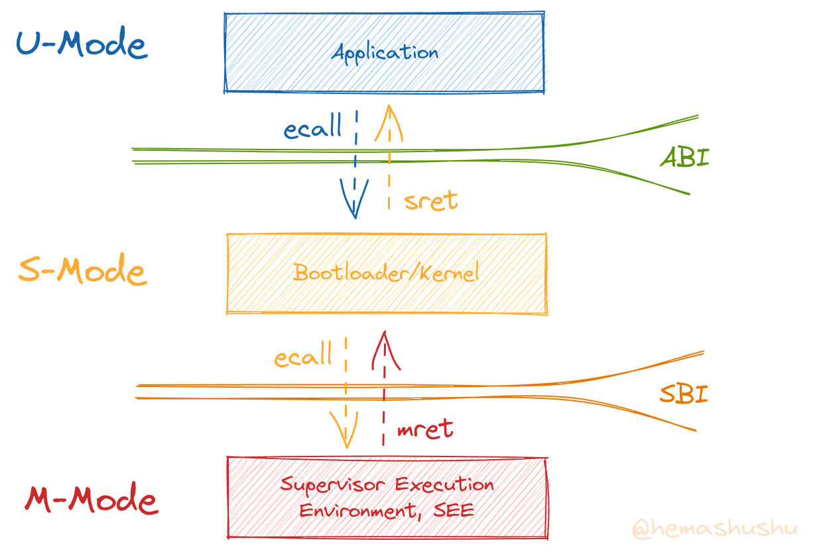
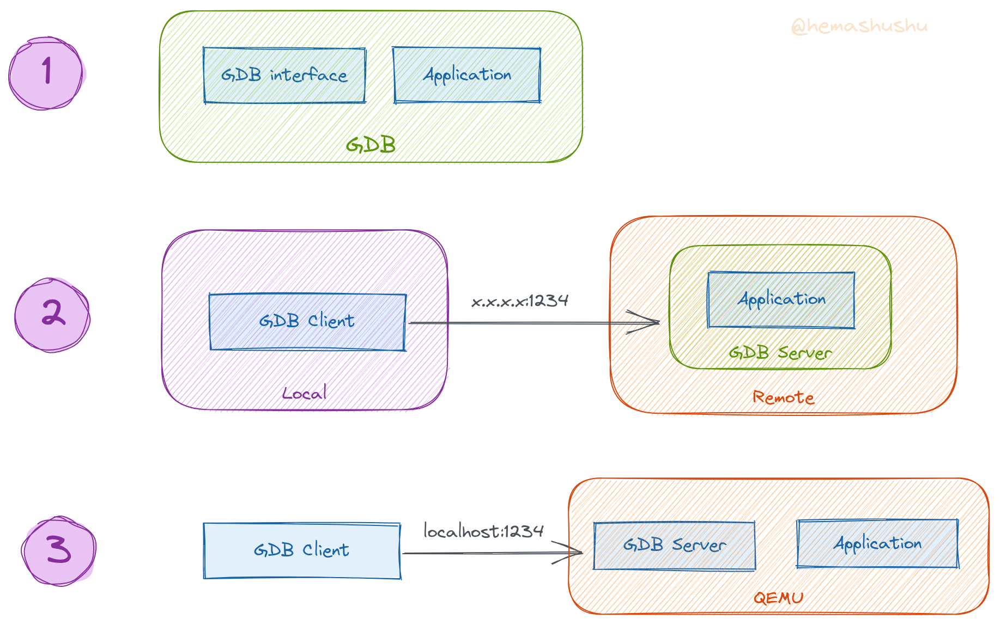
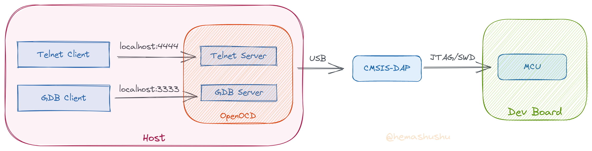
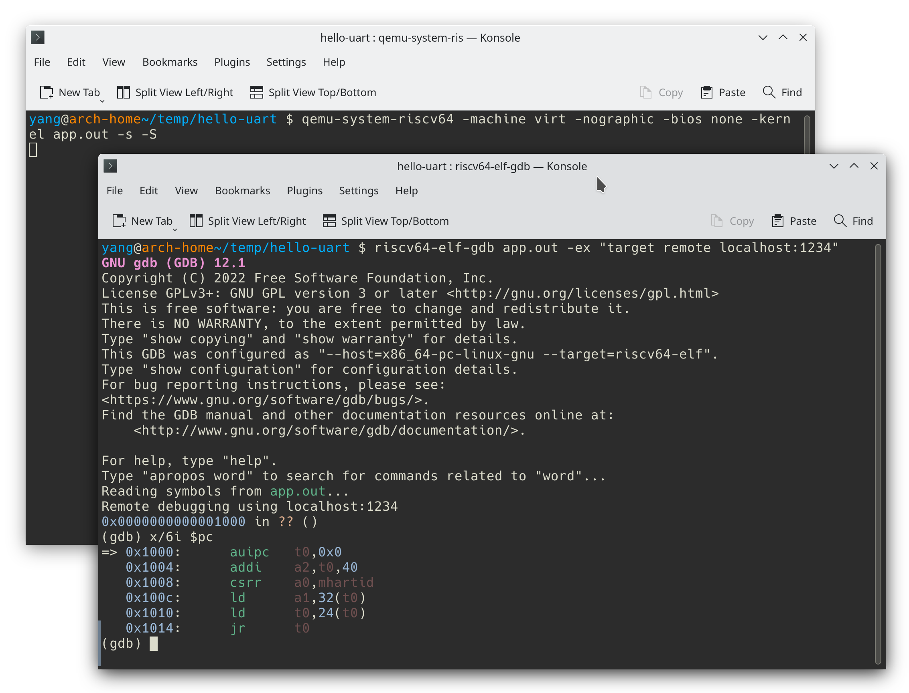

# QEMU、OpenSBI 及裸机程序的调试

在[上一篇文章](../build-risc-v-program-from-assembly-code/README.zh-Hans.md)我们了解了一个 RISC-V 程序的组成和运行原理，其中程序都是在 QEMU 里运行的，这篇文章将会讲解 QEMU 的详细使用方法，OpenSBI 的作用，以及通过 QEMU 调试裸机程序的方法。

<!-- @import "[TOC]" {cmd="toc" depthFrom=2 depthTo=6 orderedList=false} -->

<!-- code_chunk_output -->

- [QEMU 全系统模式](#qemu-全系统模式)
  - [运行程序的原理](#运行程序的原理)
  - [加载应用程序](#加载应用程序)
  - [RISC-V 系统的特权级别](#risc-v-系统的特权级别)
  - [QEMU 其它常用参数](#qemu-其它常用参数)
  - [真实 RISC-V 硬件](#真实-risc-v-硬件)
- [OpenSBI](#opensbi)
  - [调用 SBI 服务](#调用-sbi-服务)
- [裸机程序的调试](#裸机程序的调试)
  - [GDB 的调试方式](#gdb-的调试方式)
  - [调试裸机程序](#调试裸机程序)

<!-- /code_chunk_output -->

## QEMU 全系统模式

前面的文章提到，QEMU 有两种工作模式：一种是 _全系统模式_，此时 QEMU 会模拟一整套计算机硬件，包括 CPU、内存、磁盘、网络接口、USB 接口等组件；另外一种是 _用户模式_，用于直接运行目标架构为 RISC-V 的可执行文件。

因为 _用户模式_ 在本项目里使用的场合很少，所以这篇文章主要讲解 _全系统模式_，即程序 `qemu-system-riscv64`。

### 运行程序的原理

使用 QEMU 的全系统模式运行一个裸机程序（以下叫应用程序）的大概过程如下：

1. 把应用程序的内容（`.text` 和 `.data` 等）传给 QEMU；
2. QEMU 会把程序的内容加载进虚拟机的内存里；
3. 从应用程序的指令序列的第一个（或者指定入口地址的）指令开始执行指令。

QEMU 有一小段固定的程序（_ROM_），程序当中的部分数值是 QEMU 动态生成的，具体生成过程可以参阅 QEMU 源码 [/hw/riscv/boot.c](https://github.com/Xilinx/qemu/blob/master/hw/riscv/boot.c)。该 ROM 的地址是 `0x1000`，主要内容如下：

```text
0x1000:     auipc   t0,0x0          # t0 = $pc + sign_extend(immediate) << 12
                                    #       t0 == 0x1000
0x1004:     addi    a2,t0,40        # a2 = t0 + 0x28
                                    #       a2 == 0x1028
                                    # 0x1028 是结构体 fw_dynamic_info 的内容的地址
                                    #
0x1008:     csrr    a0,mhartid      # Hart ID Register (mhartid)
                                    #       即运行当前代码的硬件线程（即 CPU 核）的 ID，
                                    #       所有 CPU 核都会运行这段程序，所以 a0 的值会因 CPU 核而不同，
                                    #       对于第一个 CPU 核，其 id 为 0。
                                    #
0x100c:     ld      a1,32(t0)       # a1 = t0[0x20]
                                    #       memory[0x1020] == 0x80000000，所以 a1 == 0x87000000
                                    #
0x1010:     ld      t0,24(t0)       # t0 = t0[0x18]
                                    #       memory[0x1018] == 0x80000000，所以 t0 == 0x80000000
                                    #
0x1014:     jr      t0              # 跳转到 0x80000000
                                    #
0x1018:     .2byte  0x0             # start_addr, 0x80000000
0x101a:     .2byte  0x8000          #
0x101c:     .2byte  0x0             #
0x101e:     .2byte  0x0             #
                                    #
0x1020:     .2byte  0x0             # fdt_laddr, 0x87000000
0x1022:     .2byte  0x87e0          #
0x1024:     .2byte  0x0             #
0x1026:     .2byte  0x0             #
...
0x1038:     .2byte  0x0             # fw_dyn, 0x86000000
0x103a:     .2byte  0x8600          #
0x103c:     .2byte  0x0             #
0x103e:     .2byte  0x0             #
```

指令后面已加了注释，简单来说，这段程序主要实现了：

1. 设置寄存器 `a0` 的值为 CPU 核的 id；
2. 设置寄存器 `a1` 和 `a2` 的值，暂时可忽略；
3. 然后跳转到 `0x80000000`。

显然只要应用程序的起始地址为 `0x80000000`，QEMU 就能运行应用程序。

### 加载应用程序

将应用程序传给 QEMU 程序有 3 个参数都可以实现：

1. 通过 `-bios` 参数传递；
2. 通过 `-kernel` 参数传递；
3. 通过 `-device loader` 参数传递。

虽然这 3 个参数的含义不相同，不过对于一个简单的裸机程序来说，却都是可行的加载方法。

在本文的子目录 [resources/hello-uart](resources/hello-uart/) 里有一个简单的裸机程序，程序的功能是向串口控制台打印一行 "Hello UART!" 文本。首先编译该程序：

```bash
$ riscv64-elf-as -g -o app.o app.S
$ riscv64-elf-ld -T app.lds -o app.out app.o
```

现在得到一个 ELF 格式的可执行文件 `app.out`。下面的 3 个命令行都可以正确运行该程序：

- `qemu-system-riscv64 -machine virt -nographic -bios app.out`
- `qemu-system-riscv64 -machine virt -nographic -bios none -kernel app.out`
- `qemu-system-riscv64 -machine virt -nographic -bios none -device loader,file=app.out`

其中的参数：

- `-machine virt` 用于指定板子（board）的类型，跟 x86 的成熟硬件环境不同，RISC-V 的 CPU 通常是跟 PCB 板子固定搭配（也就是说你不能像 x86 那样分别购买 CPU 和主板然后再组装在一起），而各个板子配置的外设也很不相同。还有一部分 RISC-V 系统是以 MCU（或者 SoC）的形式存在。总之各个 RISC-V 系统的硬件相差较大，所以在虚拟一个 RISC-V 系统时，QEMU 需要你指定你所需要的板子类型。一般来说如果想虚拟跟 MCU 类似的系统，可以选择 `sifive_e`，如果没有特别的需求，只想虚拟一台普通的 RISC-V，可以选择 `virt`。QEMU 支持的板子类型可以使用命令 `$ qemu-system-riscv64 -machine help` 列出。

- `-nographic` 禁用图形输出，相当于一台没有集成显卡，也没有核显，同时把显卡拔掉之后的桌面电脑，系统产生的文字信息只能通过串口控制台（Serial Console， Serial Monitor）输出，对于 QEMU 来说，串口控制台输出的文字最终会重定向到运行 QEMU 程序的虚拟终端（Terminal）。

> 注意 `-display none` 跟 `-nographic` 不同，前者在虚拟系统里仍然存在显卡（当然是虚拟的显卡），只是相当于把显示器关掉了。也就是说，系统产生的图像或文字信息仍然会照旧输出到虚拟显卡，但因为你把显示器关掉了，所以什么信息都看不到。

QEMU 的参数说明，可以通过命令 `$ man qemu-system-riscv64` 查看。

注意在上面的 3 个命令的后两个命令中，需要指定 `-bios none`，如果不指定该参数，QEMU 会使用默认的参数 `-bios default`，它会使用内置的 OpenSBI 作为固件，该固件的起始地址也是 `0x8000_0000`，所以会导致无法加载同样地址的应用程序 `app.out`。对于 QEMU RISC-V 系统的参数说明，可以参阅 [QEMU RISC-V System emulator](https://www.qemu.org/docs/master/system/target-riscv.html)。

QEMU 除了可以加载 ELF 格式的可执行文件，还可以加载不带任何调试信息和元信息的二进制文件（即只保留可执行文件当中的 `.text`, `.rodata`, `.data`, `.bss` 等必要 `段`），通过命令 `$ riscv64-elf-objcopy -S -O binary app.out app.bin` 可以得到的二进制文件 `app.bin`。所以上面的 3 个命令还能够这样写：

- `qemu-system-riscv64 -machine virt -nographic -bios app.bin`
- `qemu-system-riscv64 -machine virt -nographic -bios none -kernel app.bin`
- `qemu-system-riscv64 -machine virt -nographic -bios none -device loader,file=app.bin,addr=0x80000000`

注意第 3 个命令的 `-device` 参数值后面比之前的版本新增了 `addr=0x80000000`，这个值用于指定二进制内容加载到内存的哪个位置。对于 ELF 格式的可执行文件来说是不需要这个参数值的，但二进制文件不包含物理内存位置和虚拟内存位置信息，因此需要额外指出。

既然 `-bios`、`-kernel` 和 `-device loader` 都用于加载可执行文件，那么为什么还需要分别设置 3 个参数呢？原因需要从 RISC-V 系统的特权级别以及系统的启动过程讲起。

### RISC-V 系统的特权级别

RISC-V 系统的特权级别一般有 3 层，从底层到顶层分别是：

1. 机器模式（Machine, M-Mode）
2. 监督模式 (Supervisor，S-Mode)
3. 用户/应用模式 (User/Application, U-Mode)

> 层级的配置并不是固定的，对于简单的 RISC-V CPU，比如 MCU，可以只有 M-Mode 一种级别。稍微强大一点的可以只有 M-Mode 和 U-Mode。对于支持虚拟化技术的 CPU，在第 1 和 2 级之间还可以有 _虚拟监督模式_ (Hypervisor, H-Mode)

从底层到顶层，每一层都在管理和小心翼翼地呵护下一层的程序，同时又有求必应，为下一层的程序执行那些枯燥无味的操作。为了实现这种权限结构，低层都会比高层拥有更大的权限（具体表现为：能执行更多的指令，能访问更多的资源），处于高层的程序如果想执行更高权限的操作，只能通过 `ecall` 指令向它的低一层请求。每两层之间都有规定的交流接口：

- U-Mode 和 S-Mode 之间的交流接口叫 ABI（Application binary interface），ABI 可以粗略理解为在汇编语言层面的 API。ABI 也可以称为 _系统调用_（Syscall）。
- S-Mode 和 M-Mode 之间的交流接口在 RISC-V 系统里叫做 SBI（Supervisor Binary Interface），SBI 在表现形式上跟 ABI 是一样的，只不过它处于的层级不同而定了一个新的名称，具体的内容可以参考 [SBI 规范](https://github.com/riscv-non-isa/riscv-sbi-doc/releases)



我们平常接触的普通应用程序运行在 U-Mode，而操作系统的内核则运行在 S-Mode，通常系统引导程序（Bootloader）也是运行在 S-Mode。而运行于机器模式的程序用于封装一些比较底层的硬件操作，比如暂停或者恢复 CPU 某个核，同时用于捕捉和处理操作系统内核引起的异常，比如内核崩溃（即 _kernel panic_，有些教程翻译为 _内核恐慌_ 实际上是错误的）之后向屏幕显示一些提示信息。运行于 M-Mode 的程序也称为 _监督模式执行环境_（Supervisor Execution Environment，SEE），目前有几个运行于 M-Mode 的程序，比如 [OpenSBI](https://github.com/riscv-software-src/opensbi) 以及 [RustSBI](https://github.com/rustsbi/rustsbi)，这些程序有时也被称为 _固件_（Firmware）。

QEMU 的参数 `-bios` 一般用于传入诸如 OpenSBI 等固件，而参数 `-kernel` 则用于传入 Bootloader 或者操作系统内核，`-kernel` 支持传入压缩文件。

> 当参数 `-kernel` 传入的是 Linux 内核映像时，通常还会搭配 `-append` 参数用于指定内核的命令行参数。

### QEMU 其它常用参数

QEMU 还有几个常用的参数：

- `-smp` 指定 CPU 的核数量，默认的核是 1，如果想模拟多核的系统，对于 RISC-V 板子 `virt` 最多可以指定 8 个核。
- `-m` 指定内存的容量，默认是 128 MB，如果要运行一个完整的 Linux 系统，建议取 2 GB 以上，比如 `-m 2G`。

更多参数可以参阅 [QEMU - Generic Virtual Platform (virt)](https://www.qemu.org/docs/master/system/riscv/virt.html)，或者查看完整的参数 [QEMU User Documentation](https://www.qemu.org/docs/master/system/qemu-manpage.html)。

另外还有几个常用的设备：

- 块设备，即虚拟磁盘，使用两个参数完成：

```text
-device virtio-blk-device,drive=ID_NAME
-drive file=IMAGE_FILE_NAME,format=raw,if=none,id=ID_NAME
```

其中 `IMAGE_FILE_NAME` 是磁盘映像文件的路径，`format` 是映像的格式，一般有 `raw` 和 `qcow2` 两种。`if` 用于指定接口类型，可选的值有 `ide`, `scsi`, `sd`, `pflash`, `virtio` 和 `none` 等。

有时也可以简写为：

```text
-drive file=IMAGE_FILE_NAME,if=virtio
```

有关虚拟磁盘的详细信息可以参阅 [QEMU Disk Images](https://www.qemu.org/docs/master/system/images.html) 和 [QEMU Block device options](https://www.qemu.org/docs/master/system/qemu-manpage.html#hxtool-1)。

- 网络接口，即虚拟网卡，使用两个参数完成：

```text
-device virtio-net-device,netdev=ID_NAME
-netdev user,id=ID_NAME
```

使用这种方式主机（host）和虚拟机（guest）都不用额外的设置，在虚拟机里直接通过 NAT 可以访问主机及外部网络。不过如果想在虚拟机里监听某个端口，让主机或者外部网络访问，则比较方便的方法是用端口映射，只需在 `-netdev` 后面添加映射的端口列表即可，比如：

`-netdev user,id=net,hostfwd=tcp::2222-:22,hostfwd=tcp::12345-:1234`

上面会把虚拟机的 SSH server 端口 `22` 和 GDB Server 端口 `1234` 分别映射到 `2222` 和 `12345`，这样一来，访问主机的 `2222` 端口就会重定向到虚拟机的 `22` 端口，因此使用 SSH 登录虚拟机的命令如下：

`$ ssh -p 2222 USER_NAME@localhost`

- 文件映射，即把主机的某个文件或者目录映射进虚拟机里，使用两个参数完成：

```text
-device virtio-9p-pci,fsdev=ID_NAME,mount_tag=sf_tag
-fsdev local,id=ID_NAME,path=/path/to/your/host/dir,security_model=mapped-file
```

在虚拟机里，使用 `mount` 命令挂载之后就可以访问主机的目录了，比如：

```bash
$ sudo mkdir -p /mnt/host
$ sudo mount -t 9p sf_tag /mnt/host
```

- 随机产生器，使用两个参数完成：

```text
-device virtio-rng-device,rng=ID_NAME
-object rng-random,filename=/dev/urandom,id=ID_NAME
```

QEMU 还有很多使用技巧，感兴趣的可以参阅 [QEMU - Arch Linux Wiki](https://wiki.archlinux.org/title/QEMU) 和 [QEMU Options - Gentoo Wiki](https://wiki.gentoo.org/wiki/QEMU/Options)。

### 真实 RISC-V 硬件

本项目主要使用 QEMU RISC-V 来运行一个 Linux 开发环境，或者用 _全系统模式_ 来运行裸机程序，而比较少使用真实的 RISC-V 硬件来运行和测试，主要是因为使用虚拟机比较方便。

另一个原因是目前（截至 2022 年秋）RISC-V 的硬件环境还不太成熟稳定。RISC-V 芯片目前主要有目标为高性能的桌面和服务器芯片，以及目标为嵌入式设备的 MCU。高性能芯片价格比较昂贵，同时软件环境还不太完整（主要依赖移植 Linux 系统现有的软件，客观来说这需要一个漫长的过程）。

至于 MCU 本应是 RISC-V 较好的应用场景，而现实情况一言难尽，大部分芯片以及开发板的开发文档非常不完整，所用的工具五花八门且欠缺广泛的测试，配套工具软件的生命周期很短，至于能流畅进行片上调试（OCD）的更加稀少。因此河马蜀黍当前比较推荐使用虚拟机来运行、测试和调试 RISC-V 程序。

## OpenSBI

当使用 QEMU 模拟一个完整的 Linux 系统时，通常使用 OpenSBI 作为 `-bios`，使用 [U-Boot](https://www.denx.de/wiki/U-Boot) 作为 `-kernel`，然后将包含有 Linux 内核、根文件系统、基础软件的磁盘映像作为 _块设备_ 传给 QEMU。

U-Boot 是一个 Bootloader，其作用是从磁盘加载内核镜像，然后跳转到内核的入口，内核启动后 Bootloader 的任务也就结束了，这里不展开讲述。而 OpenSBI 则不同，它会对上一层的程序（也就是内核）提供部分硬件功能的调用服务，同时也会捕捉上一层程序的异常，在内核运行期间，OpenSBI 将一直驻留在内存中。下图是这几个程序的启动顺序：


> 注意 OpenSBI 和 Bootloader 都是由 ROM/QEMU 加载的，OpenSBI 并没有加载 Bootloader 的功能。内核倒是由 Bootloader 加载的。对于一些比较简单的系统，也可以不需要 Bootloader，而是由 OpenSBI 直接跳转到内核。

OpenSBI 在跳转到 Bootloader 时，需要知道 Bootloader 的入口（即地址），因此 OpenSBI 有 3 种方式跳转方式，对应编译它之后得到的 3 个不同 Firmware：

1. fw_jump.bin
   OpenSBI 直接把 Bootloader 的入口地址硬编码到程序里，因此 Bootloader 必须根据 OpenSBI 指定的地址加载进内存。跳转地址的数值会根据具体的平台而有所不同，如果没有特别指定，默认的是 `0x80400000`（32-bit 系统）或者 `0x80200000`（64-bit 系统），也可以查看 OpenSBI 的源代码 [/platform/generic/objects.mk](https://github.com/riscv-software-src/opensbi/blob/master/platform/generic/objects.mk)。

2. fw_dynamic.bin
   ROM/QEMU 在加载 Bootloader 时，把入口地址写在结构体 `fw_dynamic_info` 里，然后把该结构体的地址（即指针）通过寄存器 `a2` 传递给 OpenSBI。在本篇文章顶部的那段 ROM 代码里有展示该过程。

3. fw_payload.bin
   把 OpenSBI 和 Bootloader 打包为一个程序，这种跳转方式实现起来很简单。不过无论是 OpenSBI 更新还是 Bootloader 更新，都需要重新打包。一般用于 OpenSBI、Bootloader 和内核都不需要更新的微型设备。

在启动 `qemu-system-riscv64` 程序时，如果忽略 `-bios` 参数，则会使用内置的 fw_dynamic.bin。关于 OpenSBI 的更多介绍，可以参阅 [OpenSBI Deep Dive](https://riscv.org/wp-content/uploads/2019/06/13.30-RISCV_OpenSBI_Deep_Dive_v5.pdf)。

### 调用 SBI 服务

在 Bootloader 或者内核里调用 SBI 的服务，跟在应用程序里向内核发起 _系统调用_ 的方式非常相似。根据 [SBI 规范](https://github.com/riscv-non-isa/riscv-sbi-doc/releases) 的说明：

- SBI 服务被分为 `Base`, `Timer` 等 7 个类别，在规范里称为 `extension`，每个 `extension` 都有一个 ID，叫 `eid`，比如 `Base Extension` 的 `eid` 是 `0x10`，`Timer Extension` 的是 `0x54494D45`；
- 每个 `extension` 里有一系列函数，每个函数都有一个 ID，叫 `fid`，比如 `Base Extension` 里的函数 `sbi_get_spec_version` 的 `fid` 是 `0x0`，`sbi_get_impl_id` 的是 `0x1`；
- 调用 SBI 服务时，将 `eid` 传入寄存器 `a7`，将 `fid` 传入寄存器 `a6`，将参数传入寄存器 `a0` 到 `a5`，然后执行 `ecall` 指令。
- SBI 服务将结果通过寄存器 `a0` 和 `a1` 返回，其中 `a0` 是错误代码，如果函数成功，则错误代码是 `0`，而 `a1` 则是我们真正需要的返回值。

> 完整的 `eid` 和 `fid` 也可以从 OpenSBI 源代码 [/include/sbi/sbi_ecall_interface.h](https://github.com/riscv-software-src/opensbi/blob/master/include/sbi/sbi_ecall_interface.h) 获得。

在本文的子目录 [resources/hello-sbi] 里有一个简单的调用 SBI 服务的示例程序，其作用是依次调用 `sbi_get_spec_version` 和 `sbi_get_impl_id` 函数，即获取当前系统的 SBI 规范版本号以及 SBI 服务程序的实现者代号（比如 0 代表 _Berkeley Boot Loader (BBL)_，1 代表 _OpenSBI_，4 代表 _RustSBI_），然后将结果输出到串口控制台。

程序比较简单，这里仅展示关键的部分 `sbi-base.S`：

```s
.equ sbi_base_eid, 0x10
.equ sbi_get_sbi_spec_version_fid, 0
.equ sbi_get_sbi_impl_id_fid, 1

sbi_get_spec_version:
    li      a7, sbi_base_eid
    li      a6, sbi_get_sbi_spec_version_fid
    ecall
    mv      a0, a1
    ret

sbi_get_impl_id:
    li      a7, sbi_base_eid
    li      a6, sbi_get_sbi_impl_id_fid
    ecall
    mv      a0, a1
    ret
```

基本上就是设置寄存器 `a7`, `a6` 的值，然后执行 `ecall` 指令，对于返回值，为了简化程序，这里只获取 `a1` 的值，所以使用指令 `mv a0, a1` 把寄存器 `a0` 原来的值用 `a1` 的值覆盖了。这样 C 语言就可以像调用普通函数一样只返回一个 int 类型的值。

子目录里有一个 Bash 脚本 `run.sh` 实现所有的编译、链接和运行工作，执行 `run.sh`：

`$ ./run.sh`

输出结果如下：

```text
OpenSBI v1.0
   ____                    _____ ____ _____
  / __ \                  / ____|  _ \_   _|
 | |  | |_ __   ___ _ __ | (___ | |_) || |
 | |  | | '_ \ / _ \ '_ \ \___ \|  _ < | |
 | |__| | |_) |  __/ | | |____) | |_) || |_
  \____/| .__/ \___|_| |_|_____/|____/_____|
        | |
        |_|

Platform Name             : riscv-virtio,qemu
Platform Features         : medeleg
Platform HART Count       : 1
Platform IPI Device       : aclint-mswi
Platform Timer Device     : aclint-mtimer @ 10000000Hz
Platform Console Device   : uart8250
Platform HSM Device       : ---
Platform Reboot Device    : sifive_test
Platform Shutdown Device  : sifive_test
Firmware Base             : 0x80000000
Firmware Size             : 252 KB
Runtime SBI Version       : 0.3

Domain0 Name              : root
Domain0 Boot HART         : 0
Domain0 HARTs             : 0*
Domain0 Region00          : 0x0000000002000000-0x000000000200ffff (I)
Domain0 Region01          : 0x0000000080000000-0x000000008003ffff ()
Domain0 Region02          : 0x0000000000000000-0xffffffffffffffff (R,W,X)
Domain0 Next Address      : 0x0000000086000000
Domain0 Next Arg1         : 0x0000000087e00000
Domain0 Next Mode         : S-mode
Domain0 SysReset          : yes
```

从中可见当前系统的 SBI 规范版本是 `0.3`，实现程序是 _OpenSBI_，并且应用程序 `app.out` 的入口地址 `0x8600_0000` 也正确地取得。

然后下面是程序 `app.out` 的输出内容：

```text
Hello SBI!
SBI specification version, major: 0, minor: 3.
SBI implementation ID: 1.
```

结果是正确的。

## 裸机程序的调试

使用 QEMU 调试裸机程序非常方便，只需在启动 QEMU 程序时，在命令行参数末尾添加上 `-s -S` 参数，QEMU 就会成为一个 GDB Server，然后开发者就可以使用 GDB Client 来进行调试了。其中参数：

- `-s` 是 `-gdb tc::1234` 的简写，表示 QEMU 将会在 TCP 端口 `1234` 开启 GDB Server。
- `-S` 表示 QEMU 启动后先暂停 CPU，直到 GDB Client 连接进来并执行诸如 `c`，`si` 等命令，QEMU CPU 才开始执行指令。

### GDB 的调试方式

GDB 程序可以分为 _服务端_ 和 _客户端_，其中服务端负责加载和执行目标程序，客户端负责加载目标程序的符号，以及向服务端发送各种调试命令。

> 如果准备调试某个程序，通常需要在 GCC 编译生成目标程序时加上 `-g` 参数，以便在调试时能显示相应的源代码。



上图是常见的几种调试方式：

1. GDB 调试本地的程序

这是最常见的一种方式，GDB 直接加载、运行、调试位于本地的目标程序。此时 GDB 程序可以视为集服务端和客户端于一体。比如假设有一个可执行文件 `app.out`，有某个函数未能预期工作，那么可以用命令 `$ gdb app.out` 来开始调试。进入 GDB 交互界面后，就可以 "开始为函数设置断点、逐行运行、观察局部变量及寄存器状态" 等一系列常规操作。

调试本地程序也可以分成服务端和客户端两个程序进行，即用命令 `$ gdbserver localhost:1234 app.out` 启动 GDB Server，用命令 `$ gdb -ex "target remote localhost:1234"` 启动 GDB Client。不过实在没必要这样做。

使用这种调试方式有一个局限：就是目标程序必须是当前平台可运行的（即架构和平台都符合）。

2. GDB Server 在另外一台机器上运行

开发者在当前机器上运行的 GDB 会作为客户端，通过 GDB `target remote HOST:PORT` 命令连接到 GDB Server，然后向 GDB Server 发送调试命令、查看调试的结果等。

这种调试方式意味着目标程序是在另一台机器上运行，也就是说，此时在 GDB Client 里所有的显示信息，包括程序的共享库加载情况、进程的内存映射情况、寄存器的值等，都是 Server 机器上的信息。

让人疑惑的是，使用这种方式启动 GDB Client 时，一般也同时需要在本机上有目标程序、目标程序的源代码，而且也需要加载进 GDB Client 里。这是因为 GDB Server 只负责执行目标程序，虽然目标程序里本来就有调试信息，但 GDB Server 发送给客户端的只有当前指令的位置以及寄存器和内存数据等有限的内容。GDB Client 需要程序的符号信息（比如函数的名称、地址、源代码等）才能将有限的数据还原为现场信息（比如将当前执行位置转换为源代码的当前行）。

3. GDB Server 为 QEMU。

这种方式其实跟第 2 种情况类似，只不过 GDB Server 在背后同时启动了一台虚拟机，并且完全控制这台虚拟机的硬件。

4. GDB Server 为 OpenOCD



这种方式常见于调试 MCU 或者 FPGA 的情况，之所以需要 OpenOCD 作为中间媒介，是因为目标机器根本无法运行 GDB Server，它只提供有限的调试能力。OpenOCD 起到一个 _适配器_ 的作用，把有限的调试能力转换为大家熟悉的 GDB 界面（技术来说，是 OpenOCD 提供了 GDB Server Protocol）。QEMU 的调试功能其工作原理跟 OpenOCD 类似。

> 注意图当中的 `JTAG` 和 `SWD` 是仿真器跟 MCU 之间的通信协议（也可以理解为仿真器跟 MCU 之间的电线连接方式），而 `CMSIS-DAP` 以及常见的 `ST-Link`，`DAPLink` 等是仿真器（也叫下载器、调试器）硬件的名称。

> 有些 MCU 开发板自带了仿真器，比如 _micro:bit_ 通过 USB 连接到电脑之后会出现一个 U 盘，然后把 _HEX/BIN_ 文件往里面拖放就可以完成烧录，其实这是 `DAPLink` 的功能。使用 OpenOCD 连接 MCU 开发板时，需要指定 `interface/*.cfg` 文件，该文件主要内容就是用于指定仿真器（驱动）的名称。

### 调试裸机程序

下面演示如何通过 QEMU 调试裸机程序，所使用的程序是本文开头演示的 `hello-uart`。

首先编译：

```bash
$ riscv64-elf-as -g -o app.o app.S
$ riscv64-elf-ld -T app.lds -o app.out app.o
```

注意要添加 `-g` 参数，这样在调试时能显示等多信息。

然后启动 QEMU 的调试服务：

`$ qemu-system-riscv64 -machine virt -nographic -bios none -kernel app.out -s -S`

现在 QEMU 应该是处于静止的状态，正等待 GDB Client 连接。




`set disassemble-next-line on`