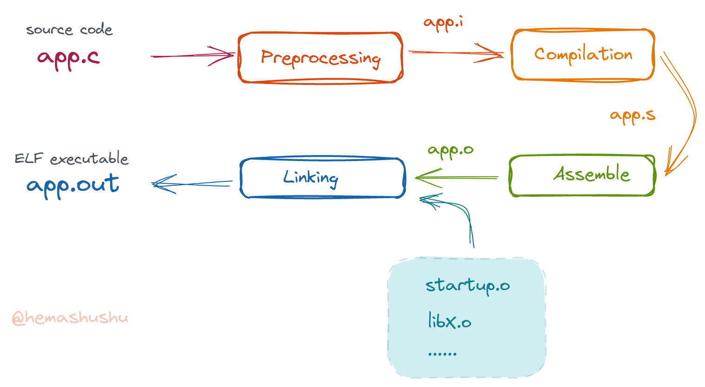

# RISC-V GCC 快速入门

XiaoXuan Assembler 需要其它编译器的编译结果作为参照物，而 [RISC-V GCC](https://github.com/riscv-collab/riscv-gnu-toolchain) 是比较完善和成熟的 RISC-V 编译器，因此 XiaoXuan Assembler 默认选用它对编译、汇编和链接的结果进行参考、验证和测试。

本篇文章将会构建两个非常简单的程序：一个 "Hello World!" 程序和一个裸机程序，通过构建的过程以简单了解 RISC-V GCC 的基本使用方法。

<!-- @import "[TOC]" {cmd="toc" depthFrom=2 depthTo=6 orderedList=false} -->

<!-- code_chunk_output -->

- [RISC-V GCC 介绍](#risc-v-gcc-介绍)
- [QEMU 模拟器](#qemu-模拟器)
- [第一个程序](#第一个程序)
  - [编译](#编译)
  - [可执行文件](#可执行文件)
  - [二进制工具](#二进制工具)
    - [`size`](#size)
    - [`readelf`](#readelf)
    - [`objdump`](#objdump)
  - [运行](#运行)
  - [分阶段编译](#分阶段编译)
  - [常用的编译参数](#常用的编译参数)
- [裸机程序](#裸机程序)
  - [程序的组成](#程序的组成)
    - [基础库](#基础库)
    - [计算库](#计算库)
    - [主程序](#主程序)
    - [启动器](#启动器)
  - [编译](#编译-1)
  - [打包目标文件](#打包目标文件)
  - [链接](#链接)
  - [运行](#运行-1)

<!-- /code_chunk_output -->

## RISC-V GCC 介绍

假设我们工作环境的架构是 _x86_64_，现在需要把程序（的源代码）编译成可以在 RISC-V 架构上运行的程序，这种编译叫做 _交叉编译_。相对地，在 “当前架构” 里编译出给 "当前架构" 运行的程序，这种编译叫 _本地编译_，或者简称编译。交叉编译本质上是 "根据源代码生成目标架构的一系列指令"，交叉编译器在的实现方法跟普通的编译器是一样的，只是生成的指令不是当前架构，而是目标架构的指令。

在进行交叉编译时，通常需要确定 _目标架构_ 和 _目标平台_。

- _目标架构_ 是指目标机器的 CPU 指令集架构（ISA，有时简称为 _指令集_ 也是可以的），比如常用的 Intel 和 AMD CPU 的指令集是 _x86_64_，移动电话用的 ARM CPU 指令集是 _aarch64_，以及项目 XiaoXuan Assembly - RISCV 的目标 CPU 的指令集是 _rv64g_ 等等。
- _目标平台_ 是指 _目标操作系统_，当然在开发程序时，可能还得考虑目标平台更细化的一些信息，比如目标平台是哪个 Linux 发行版，因为不同的发行版的文件系统层次结构（FHS，Filesystem Hierarchy Standard）往往有细微的差别，这会导致诸如共享库等文件的所在位置有所不同。但对于编译器来说，它只需确定目标架构和目标平台即可。

对于 _裸机程序_，即在 "无操作系统" 的环境里运行的程序，比如在微控制器（MCU）里运行的程序，或者内核程序，在编译时则只需确认 _目标架构_ 即可。

GCC 是一套常用编译工具（另一个是 LLVM），而 RISC-V GCC 则是基于 GCC 且目标架构设定为 RISC-V 的交叉编译工具。在大部分 Linux 发行版里都可以通过包管理器找到它并安装它。注意在通过包管理器安装 RISC-V GCC 的时候，可能会发现有两套名称相近的工具，比如在 _Arch Linux_ 里，有 `riscv64-elf-gcc`、`riscv64-elf-gdb`、`riscv64-elf-binutils` 和 `riscv64-linux-gnu-gcc`、`riscv64-linux-gnu-gdb`、`riscv64-linux-gnu-binutils`（在 _Ubuntu_ 里，它们分别叫 `gcc-riscv64-unknown-elf`、`gcc-riscv64-linux-gnu` 和 `gdb-multiarch`）。前者用于编译 "裸机" 程序，后者用于编译在 Linux 环境中运行的程序，也就是我们平常所接触到的程序。条件允许的话，建议两套工具都安装。如果你系统的包仓库里没有 RISC-V GCC，则可以从 [官方的仓库](https://github.com/riscv-collab/riscv-gcc) 下载源码并通过源码的方式安装。

## QEMU 模拟器

对于 RISC-V GCC 生成的程序，当然需要在 RISC-V 架构的机器上运行，不过至书写本文的时间（2022 年）为止，尚未有成熟且经济的 RISC-V 硬件，大部分 RISC-V 计算机仍以开发板的形式提供。所以为了便于测试程序，XiaoXuan Assembler 是通过 [QEMU](https://www.qemu.org/) 模拟器来运行和测试 RISC-V 程序的。

大部分 Linux 发行版里的包仓库里都包含有 QEMU，所以只需使用系统的包管理器就可以安装 QEMU，比如在 _Arch Linux_ 里，需要安装包 `qemu-system-riscv`、`qemu-user` 和 `qemu-user-static`（在 _Ubuntu_ 里，包名分别为 `qemu-system`，`qemu-user` 和 `qemu-user-static`）。对于包仓库里没有 QEMU 的发行版，可以下载 QEMU 的源码，然后根据[这篇指引](https://wiki.qemu.org/Documentation/Platforms/RISCV)编译安装。

QEMU 可以模拟一整套完整的硬件，包括 CPU、内存、磁盘、网络接口、USB 接口等组件，除此之外，QEMU 还可以模拟一个 Linux 系统。也就是说，QEMU 有两种工作模式，前者称为 _全系统模式_，在这种模式下可以执行所有 CPU 指令，可以运行裸机程序。后者称为 _用户模式_，可以直接运行编译目标平台为 Linux 的程序。

全系统模式使用程序 `qemu-system-riscv64` 来启动，可以通过参数指定机器类型、CPU 核心的数量、内存的容量、虚拟磁盘等。用户模式使用程序 `qemu-riscv64` 来启动，把我们写的应用程序（可执行文件）的文件路径作为参数传给这个程序即可，在这种模式下，QEMU 会把应用程序转换为主机平台支持的程序，所以如果要写了一个向控制台打印一行字符的 "Hello world" 程序，让它跑起来的最快方法是使用 `riscv64-linux-gnu-gcc` 编译，然后使用 `qemu-riscv64` 来运行。

## 第一个程序

第一个程序是一个非常简单的程序，其功能是向屏幕打印一行文字 "Hello world!"。下面快速地过一遍编译、链接、运行的过程。

第一个程序的源代码文件位于目录 [resources/hello-world](./resources/hello-world/) 里，文件名为 `app.c`，其内容如下：

```c
#include <stdio.h>

int main() {
    printf("Hello world!\n");
    return 0;
}
```

### 编译

首先切换到文本所在的目录的子目录 [resources/hello-world](./resources/hello-world/)：

`$ cd resources/hello-world`

因为这不是 "裸机" 程序，因此需要使用 `riscv64-linux-gnu-gcc` 来编译：

`$ riscv64-linux-gnu-gcc -g -Wall -o app.out app.c`

- 参数 `-g` 用于生成额外的调试信息（可供 GDB 使用）；
- 参数 `-Wall` 用于报告编译过程中的所有警告和错误信息；
- 参数 `-o app.out` 用于指定输出的文件的名称，如果缺省这个参数，默认的输出文件名为 `a.out`。

编译完成后得到文件 `app.out`。

### 可执行文件

使用 `file` 命令可以查看该文件的格式：

`$ file app.out`

输出结果如下：

```text
app.out: ELF 64-bit LSB pie executable, UCB RISC-V, RVC, double-float ABI, version 1 (SYSV), dynamically linked, interpreter /lib/ld-linux-riscv64-lp64d.so.1, BuildID[sha1]=eb3dabb395852de771d6ac7129d1da24ca574350, for GNU/Linux 4.15.0, with debug_info, not stripped
```

- `ELF` 和 `executable`，表明当前文件是一个 ELF 格式当中的 _可执行文件_。ELF 格式的文件主要有 3 种类型：
   1. `executable` 是 _可执行文件_；
   2. `shared object` 是 _共享对象文件_，也就是共享库，用于在运行时动态地被可执行文件链接（或者说 _调用_）。
   3. `relocatable` 是 _可重定向文件_，即编译任务中途产生的 _目标文件_，当只编译而不链接一个 C 源代码文件时，产生的正是这种类型的文件。这种 "中间阶段产生" 的文件主要用来链接，以产生最后的结果 ———— 可执行文件或者共享库。

- `dynamically linked`, `interpreter ...`，表明当前可执行文件是 _动态链接_ 类型，也就是说它在运行时，要需要其它共享库的帮忙才能完成所有工作。而这些库的加载任务则由 `interpreter` 指定的程序来完成，或者说 `interpreter` 指定的是一个 _运行时动态链接器_，或者简单理解为 _应用程序初始化器，共享库加载器_。可执行文件还可以是 _静态链接_ 类型，表示它在运行时不需要其它共享库帮忙，只需操作系统的支持，其它的工作全部自己完成。

- `pie`，表明当前的可执行文件是 `位置无关的可执行文件`（`Position Independent Executables`），这部分内容将会在本项目的其它文章里讲解。

- `64-bit`, `RISC-V`, `double-float ABI`，`GNU/Linux 4.15.0`，这些零散的信息表明当前可执行文件的目标架构、目标平台以及目标平台的一些细化信息，这些内容将会在本项目的其它文章里讲解。

- `LSB`，表明当前可执行文件里的数据是 "低端字节优先"（"least-significant byte first"）的，相当于平常说的 "低端序"（"little-endian"）。相对的，还有 `MSB`，即 "高端字节优先"（"most-significant byte"），相当于 "高端序"（"big-endian"）。这决定了一个整数在内存或者磁盘种如何储存，比如数字 `0x11223344`，在内存中如果使用 `LSB`，则被储存为 "(低地址) 44 33 22 11 （高地址）"，如果使用 `MSB`，则会被储存为 "(低地址) 11 22 33 44（高地址）"。用十六进制查看器查看 `LSB` 类型的可执行文件的内容时，如果看的内容是数字，那么需要在脑海里把数字反过来再组合才是它的真实值，而如果看的内容是字符串，则可以很自然地顺序阅读。简单来说，看数字很头痛，看文本很舒畅，而 `MSB` 则刚好相反。不过这都是人类才有的烦恼，对于计算机来说都是一样的哦。

- `with debug_info`, `not stripped`，表明当前可执行文件里包含调试信息。

`file` 命令只能非常粗略地查看文件的格式和类型，如果想详细了解 `ELF` 的内容，还需要下面的二进制工具。

### 二进制工具

在安装 RISC-V GCC 时，还同时安装了 RISC-V Binutils，这套工具链提供了跟 [GNU Binutils](https://www.gnu.org/software/binutils/) 对应的工具。

#### `size`

首先是查看程序大小的工具 `size`：

`$ riscv64-linux-gnu-size app.out`

输出结果如下：

```text
   text    data     bss     dec     hex filename
   1123     584       8    1715     6b3 app.out
```

- `text` 表示程序的指令序列；
- `data` 表示程序的初始数据；
- `bss` 表示未初始化的（或者初始值为 `0` 的）全局变量。
- `dec` 和 `hex` 是前面三项内容的大小（单位为字节）的总和的十进制和十六进制。

需要注意的是 `bss` 的数值用于在内存里提前分配空间，除了一个整数之外，本身不占文件任何空间，但在统计时，仍然把它也加上了。

根据上面显示的数值可知，编译器在我们写的应用程序里塞入了不少的额外的内容，毕竟当前程序只有一个只包含一条 `printf` 语句的函数，这样的一条语句不太可能对应 1000 多个字节的指令，而且文本内容 "Hello world!\n" 也没有 500 多字节。

#### `readelf`

工具 `readelf` 可以查看该 ELF 文件的详细信息：

`$ riscv64-linux-gnu-readelf -l app.out`

输出的（部分）结果如下：

```text
Elf file type is DYN (Position-Independent Executable file)
Entry point 0x5b0
There are 10 program headers, starting at offset 64

Program Headers:
  Type           Offset             VirtAddr           PhysAddr
                 FileSiz            MemSiz              Flags  Align
  LOAD           0x0000000000000000 0x0000000000000000 0x0000000000000000
                 0x00000000000006e4 0x00000000000006e4  R E    0x1000
  LOAD           0x0000000000000e08 0x0000000000001e08 0x0000000000001e08
                 0x0000000000000248 0x0000000000000250  RW     0x1000

 Section to Segment mapping:
  Segment Sections...
   03     .interp .note.gnu.build-id .note.ABI-tag .gnu.hash .dynsym .dynstr .gnu.version .gnu.version_r .rela.dyn .rela.plt .plt .text .rodata .eh_frame_hdr .eh_frame
   04     .preinit_array .init_array .fini_array .dynamic .data .got .bss
```

下面简单讲解上面的内容：

- `LOAD` 表示将会被加载进内存的 segment（因为 `segment` 和 `section` 在中文里都叫作 `段`，所以这里直接使用英文名称。一般情况下 `段` 是指 `section`），下方的 `Section to Segment mapping` 列举了每个 segment 由哪些 section 组成。

   ELF 文件的主要内容由多个段（section）组成，这些段可以形成两个视图：从程序加载器的角度看，有一个叫 `segments` 的视图；从编译器、链接器角度看有一个叫 `sections` 的视图。

- `LOAD` 项目显示了 segment 的文件偏移地址、虚拟地址、物理地址、在文件中的大小、在内存中的大小、标记等信息（这些内容会在本项目的其它文章种讲解）。这些信息会决定程序加载器如何处理 segment，比如 `RE` 标记表示这段内容在内存中具有 "read, execute" 权限，`RW` 标记表示这段内容在内存中具有 "read, write" 权限。

> 在现代的 CPU 内存管理单元里，物理内存被虚拟化，并以固定的大小（比如 4KB）划分为一个个区块（叫作 _页面_），每个内存页面都可以有不同的权限，比如有些内存页面只可读、有些可读写、有些可执行。

- `Entry point 0x5b0` 表示程序的入口，即程序第一个会被执行的指令，位于地址 `0x5b0`，。

#### `objdump`

工具 `objdump` 可以反汇编可执行文件当中的代码段，查看位置 `0x5b0` 的内容：

`$ riscv64-linux-gnu-objdump -d app.out`

输出（部分）结果如下：

```text
Disassembly of section .text:

...
00000000000005b0 <_start>:
 5b0:   022000ef                jal     ra,5d2 <load_gp>
 5b4:   87aa                    mv      a5,a0
 5b6:   00002517                auipc   a0,0x2
 5ba:   a8253503                ld      a0,-1406(a0) # 2038 <_GLOBAL_OFFSET_TABLE_+0x10>
 5be:   6582                    ld      a1,0(sp)
 5c0:   0030                    addi    a2,sp,8
 5c2:   ff017113                andi    sp,sp,-16
 5c6:   4681                    li      a3,0
 5c8:   4701                    li      a4,0
 5ca:   880a                    mv      a6,sp
 5cc:   fc5ff0ef                jal     ra,590 <__libc_start_main@plt>
 5d0:   9002                    ebreak
```

看到这里你可能感到很惊讶，原来程序的入口（即最先开始执行的指令）并不是 `main` 函数，而是一个名为 `_start` 的过程（大部分 C 语言的教科书或者教程都跟我们说：程序的入口是 `main` 函数，这是一个善意的谎言）。`_start` 过程会做一系列的初始化工作，然后才会调用 `main` 函数，在 `main` 函数执行完毕之后，它还会做一些清理工作。

在上一个输出的结果里往下翻，就可以找到函数 `main` 的内容：

```text
0000000000000668 <main>:
 668:   1141                    addi    sp,sp,-16
 66a:   e406                    sd      ra,8(sp)
 66c:   e022                    sd      s0,0(sp)
 66e:   0800                    addi    s0,sp,16
 670:   00000517                auipc   a0,0x0
 674:   02050513                addi    a0,a0,32 # 690 <_IO_stdin_used+0x8>
 678:   f29ff0ef                jal     ra,5a0 <puts@plt>
 67c:   0001                    nop
 67e:   60a2                    ld      ra,8(sp)
 680:   6402                    ld      s0,0(sp)
 682:   0141                    addi    sp,sp,16
 684:   8082                    ret
```

该段指令包含了普通函数的 _开场白_ 和 _收场白_ 模板代码，以及一句对函数 `puts` 的调用。

### 运行

因为 `app.out` 不是 "裸机" 程序，它依赖平台（即操作系统，平台提供了包括程序加载、内存分配和系统调用等功能）才能运行，为了简单起见，可以使用 QEMU 模拟器的 _用户模式_ 程序 `qemu-riscv64` 来运行：

`$ qemu-riscv64 app.out`

运行的结果是：

```text
qemu-riscv64: Could not open '/lib/ld-linux-riscv64-lp64d.so.1': No such file or directory
```

显然程序并没有正确地运行，这是因为当前应用程序调用了 `printf` 函数，而这个函数实际上是调用了标准库的函数 `puts`。

RISC-V GCC 默认产生动态链接类型的程序，在运行这种程序时需要一个 _运行时动态链接器_（在当前的例子里，它就是 `ld-*.so`）加载程序所需的共享库，以及进行一系列的初始化工作（比如寻找标准库当中函数 `puts` 的地址）。然而不幸的是 `qemu-riscv64` 好像不能正确地定位 `ld-*.so`。

> 虽然 _动态链接_ 概念对操作系统来说是不错的主意，但对于普通用户来说，应用程序的动态链接导致的问题令人相当头痛。

河马蜀黍暂时没找到优雅地解决该问题的方法，因此下面换一种方式：生成静态链接类型的可执行文件。即在用 GCC 编译时传入 `-static` 参数，用于指示 GCC 生成静态链接的程序，也就是说，GCC 会把被调用的外部函数的二进制代码（即指令序列）复制进我们的可执行文件里，这样程序在运行时就不需要其它共享库了，自然也不需要 `ld.so` 了，它直接跟操作系统打交道：

`$ riscv64-linux-gnu-gcc -static -o app.static.out app.c`

先看看文件格式：

`$ file app.static.out`

输出结果：

```text
app.static.out: ELF 64-bit LSB executable, UCB RISC-V, RVC, double-float ABI, version 1 (SYSV), statically linked, BuildID[sha1]=e5483614d4b600c22bdada95913a953eae577965, for GNU/Linux 4.15.0, with debug_info, not stripped
```

原先的 "dynamically linked" 已经变为 "statically linked"。再看看文件的大小：

`$ riscv64-linux-gnu-size app.static.out`

输出结果如下：

```text
   text    data     bss     dec     hex filename
 387532   22024   21760  431316   694d4 app.static.out
```

代码段的大小从 1KB 多增长到近 400KB，这是因为链接器把所用到的函数的二进制代码都复制过来了，如果反汇编 `app.static.out` 将会得到超长的文本，因此这里就略过了，下面运行这个静态链接的可执行文件：

`$ qemu-riscv64 app.static.out`

这次得到了预期的结果：

```text
Hello world!
```

那么究竟有没办法用 `qemu-riscv64` 运行动态链接的程序呢？方法当然是有的，只需让 `qemu-riscv64` 找到 `ld.so` 的正确路径就可以了！

如果你的系统是 _Arch Linux_，会发现文件 `ld-linux-riscv64-lp64d.so.1` 的正确目录是 `/usr/riscv64-linux-gnu/lib`，按照 `qemu-riscv64` 的说明，只要把这个路径通过参数 `-L /path/to/ld.so` 或者环境变量 `QEMU_LD_PREFIX` 传入即可，然而河马蜀黍并没有成功（原因未知）。下面演示另一种解决方法，即指定程序的 _运行时动态链接器_，操作步骤如下：

1. 在链接时传入参数 `--dynamic-linker /path/to/ld.so` 更改程序的 `interpreter`，命令如下：

   `$ riscv64-linux-gnu-gcc -g -Wall -Wl,--dynamic-linker,/usr/riscv64-linux-gnu/lib/ld-linux-riscv64-lp64d.so.1 -o app.out app.c -L /usr/riscv64-linux-gnu/lib -lc`

   编译完毕之后，可以使用 `file` 命令检查程序：

   `$ file app.out`

   输出结果如下：

   ```text
   app.out: ELF 64-bit LSB pie executable, UCB RISC-V, RVC, double-float ABI, version 1 (SYSV), dynamically linked, interpreter /usr/riscv64-linux-gnu/lib/ld-linux-riscv64-lp64d.so.1, BuildID[sha1]=973ca74e3c1f08bde10d29d173aa6370ab947b2b, for GNU/Linux 4.15.0, with debug_info, not stripped
   ```

   可见 `interpreter` 已经成功更改为指定的路径。

2. 在运行程序的时候，添加 RISC-V Linux GNU 共享库的位置：

   `$ LD_LIBRARY_PATH=/usr/riscv64-linux-gnu/lib qemu-riscv64 app.out`

如此一来就能正确运行程序了。

上面的命令的参数非常多，具体的含义，以及优雅的编译和运行动态链接程序的方法，请看本项目的另一篇文章 [动态链接的原理](../dynamic-linking/README.zh-Hans.md)。

### 分阶段编译

当执行命令 `riscv64-linux-gnu-gcc` 将一个 C 源代码编译为一个可执行文件时，实际上 GCC 是分 4 个阶段（或者说步骤）来完成的：



1. 预处理

   将源代码里的 `include` 文件包含进来，解析其中的条件编译指令（`#ifdef`），展开宏（`macro`）等。相当于命令：

   `$ riscv64-linux-gnu-cpp app.c > app.i`

   或者

   `$ riscv64-linux-gnu-gcc -E app.c > app.i`

   注意上面程序 `riscv64-linux-gnu-cpp` 当中的 "cpp" 是指 "C Preprocessor"，而不是 "C++" 的意思。经过预处理的 C 语言源代码文件的扩展名为 `*.i`。

2. 编译

   将 C 代码编译为汇编代码，相当于命令：

   `$ riscv64-linux-gnu-gcc -S app.i`

   第 1 到第 2 步也可以一步完成：

   `$ riscv64-linux-gnu-gcc -S app.c`

   生成的汇编源代码文件的扩展名为 `*.s`，注意这跟我们手写的汇编源代码文件扩展名 `*.S` 不同。大写 `S` 表示会经过预处理（比如处理 `.include` 指令）在进入下一步的汇编处理，而小写的 `s` 表示不会进行预处理。具体的扩展名和 GCC 参数可以参考[这篇文章](https://gcc.gnu.org/onlinedocs/gcc/Overall-Options.html)。

3. 汇编

   将汇编代码转换为机器指令序列，并生成目标文件，相当于命令：

   `$ riscv64-linux-gnu-as -o app.o app.s`

   第 1 到第 3 步也可以一步完成：

   `$ riscv64-linux-gnu-gcc -c -o app.o app.c`

   参数 `-c` 表示只编译但不链接。

4. 链接

   将多个目标文件链接起来，并重新定位其中的全局变量和函数的地址，最后生成 ELF 格式的可执行文件，相当于命令：

   `$ riscv64-linux-gnu-ld -o app.out app_startup.o app.o`

   上面的命令会将 `app_startup.o` 和 `app.o` 两个目标文件链接起来并生成（动态链接类型的）可执行文件 `app.out`。

   注意，上面的 `app_startup.o` 是一个假象的应用程序启动器（提供应用的入口 `_start` 过程以及做一些初始化和清理工作），在当前示例的源代码目录里并不存在，所以上面的命令并不能成功地运行。

   上面的第 1 到 第 4 个步骤可以一步完成：

   `$ riscv64-linux-gnu-gcc -o app.out app.c`

   如果你想知道 GCC 在编译过程中的每个步骤以及细节，可以传入 `-v` 参数，比如 `$ riscv64-linux-gnu-gcc -v -o app.out app.c`。

> 在平常的编译程序任务中，我们并不需要分成 4 步，一般只需分成 _编译_ 和 _链接_ 2 步，而且一般都是借助诸如 `make` 等构建工具来完成。但我们仍然需要清楚知道编译器的各个阶段的作用，理解这些概念有助于解决在编译过程遇到的各种问题。

### 常用的编译参数

除了上面已经演示过的，GCC 还有一些其它常用的参数：

- `-I` 用于指定头文件的路径

  有时头文件（`*.h`）分布在多个目录，这时可以用参数 `-I` 把额外的头文件的路径包含进来，比如当前的路径为 `/home/yang/hello-world/app.c`，假如有额外的头文件位于 `/home/yang/hello-world/include/`，则可以这样传入参数：

  `$ riscv64-linux-gnu-gcc -I /home/yang/hello-world/include app.c`

- `-L` 和 `-l` 用于指定额外库的路径和名称

  接着上一个例子，如果应用程序需要使用到库 `/home/yang/hello-world/lib/libmymath.a`，则可以这样传入参数：

  `$ riscv64-linux-gnu-gcc app.c -L /home/yang/hello-world/lib -lmymath`

  其中参数 `-lmymath` 的 `-l` 是参数名称，`mymath` 是参数值，等效于 `-l mymath`。这个参数表示编译过程会使用到库文件 `libmymath.a`。

  注意参数 `-l` 的值是库的 `soname`，比如上例种库文件的真实名称是 `libmymath.a`，去除了前缀 `lib` 和后缀 `.a`（或者 `.so`）之后就是 `soname` 了。更多的例子，比如 `libm.so` 的 `soname` 是单独一个字母 `m`，`libpthread.so` 的是 `pthread`。

> 注意：一般需要把参数 `-L ... -l ...` 放在命令的末尾，也就是依赖项的顺序必须遵循 "被依赖的放在后面" 的原则，如果顺序不对有可能导致链接失败。

GCC 的编译过程是松散的，它由上一节所述的 4 个相对独立的阶段组成，显然头文件是在预处理阶段使用，而库文件则是在链接阶段使用，当使用一个 GCC 命令编译一个程序时，参数 `-I -L -l` 需要全部填上。

## 裸机程序

裸机程序是指在 "无操作系统" 的环境中运行的程序，听起来可能会觉得很神奇：一个机器不用安装操作系统也能运行应用程序？是的，很显然诸如操作系统的引导器，以及操作系统本身就是裸机程序。

裸机程序跟普通应用程序并没有太大的区别，其中的数值计算、流程控制、程序的结构等跟普通应用程序是一摸一样的，只是在进行一些特权或者 I/O 操作时，需要直接跟硬件（包括 CPU 和外设）打交道，而不能让操作系统代劳（一般的程序是通过调用标准库，标准库再向操作系统发起 _系统调用_ 等一系列过程实现）。

幸好跟硬件打交道都不算太复杂，有些硬件在电路里被映射到某段内存地址，比如串口控制台，你只需把它们当作内存来读写，再稍微经过位运算等处理，即可获取这些硬件的状态数据或者更改它们的状态；有些硬件有专门的 CPU 指令来操作，裸机程序只需编写相应的汇编代码即可。

下面是一个 "裸机" 版的 "Hello world!" 程序，该程序实现 3 个功能：

1. 向串口控制台打印一行 "Hello world!" 文本；
2. 计算两个整数的和并显示其结果；
3. 计算一个整数加上 10 之后的值，并显示其结果。

该程序的源文件数量比较多，涉及的新鲜概念也比较多，在这篇文章里暂时不会作细致的分析，如果对其中的细节或者原理有疑惑，可以暂时忽略。后续的文章会有详细的讲解，你可以在阅读完后续的文章之后再回来看该程序的内容。

这个章节仅为了简单介绍用 GCC 编译裸机程序的过程。

### 程序的组成

程序由下列几个部分组成：

- 基础库 `put_char.S` 和 `libprint.c`
- 计算库 `liba.c` 和 `libb.c`
- 主程序 `app.c`
- 启动器 `app_startup.S`

#### 基础库

因为没有操作系统的支持，显然无法直接使用 `printf` 函数，但我们可以编写一个功能相近的简单函数。

具体来说，该应用程序准备在虚拟机 RISC-V QEMU 中运行，通过查看 [QEMU RISC-V virt 的源代码](https://github.com/qemu/qemu/blob/master/hw/riscv/virt.c) 可以找到一些基本硬件的内存映射关系：

```c
static const MemMapEntry virt_memmap[] = {
    ...
    [VIRT_MROM] =         {     0x1000,        0xf000 },
    [VIRT_UART0] =        { 0x10000000,         0x100 },
    [VIRT_FLASH] =        { 0x20000000,     0x4000000 },
    [VIRT_DRAM] =         { 0x80000000,           0x0 },
    ...
};
```

其中串口通信 UART 被映射到 `0x1000_0000`，这表明只需向该内存地址写入一个 byte 类型整数，该整数对应的 ASCII 字符就会被重定向到虚拟终端。

> 并非所有的硬件读写都是这种方式，后续的文章会详细讲解如何用汇编写驱动，比如 GPIO，I2C 等控制。

所以要实现打印单个字符的函数是很简单的，在目录 [resources/bare-metal](./resources/bare-metal/) 里有源代码文件 `put_char.S`，其内容如下：

```S
.equ VIRT_UART0, 0x10000000

.section .text.put_char

.globl put_char

put_char:
    li s1, VIRT_UART0
    mv s2, a0
    sb s2, 0(s1)
    ret
```

> 因为这段程序在虚拟机上运行，所以这里忽略了 UART 发送所需的延迟。如果是在真实硬件上编写发送字符的程序，应该检查 UART TX FIFO 的值，仅当上一个字符发送完毕之后（即 TX 空闲之后）再发送下一个字符，毕竟 CPU 的工作频率比 UART 的高很多。

打印字符函数也可以用 C 语言实现，源代码文件是 `put_char.c`，其内容如下：

```c
#define VIRT_UART0 0x10000000

volatile unsigned int *const VIRT_UART0_PTR = (unsigned int *)VIRT_UART0;

void put_char(int c)
{
    *VIRT_UART0_PTR = c;
}
```

因为这段 C 代码所表达的意思不够汇编的那么明确，所以选用了汇编版本。

在此基础之上，可以用 C 语言实现 `print_char`，`print_string` 和 `print_int` 等函数，以方便后续的调用。源代码文件为 `libprint.c`，其内容如下：

```c
#include "put_char.h"

void print_char(char c)
{
    put_char((unsigned int)c);
}

void print_string(const char *str)
{
    while (*str != '\0')
    {
        print_char(*str);
        str++;
    }
}

void print_int(int i)
{
    char s[21];
    itoa(i, s, 21);
    print_string(s);
}
```

至此，应用程序已经有打印字符、字符串和数字的能力了。

#### 计算库

接下来实现整数相加等数学函数，源代码文件分别为 `liba.c` 和 `libb.c`，其内容如下：

```c
// liba.c
int add(int a, int b)
{
    return a + b;
}

// libb.c
#include "liba.h"

int add10(int i)
{
    return add(i, 10);
}
```

> 之所以把函数划分到两个文件，是因为接下来的章节会讲述 _打包目标文件_ 的功能，即把 `liba.o` 和 `libb.o` 打包为 `libmath.a`

#### 主程序

然后再看看主程序，源代码文件 `app.c`，其内容如下：

```c
#include "libmath.h"
#include "libprint.h"

void bare_main()
{
    int a = 3;
    int b = 5;
    int m = add(a, b);
    int n = add10(a);

    print_string("Hello world!\n");
    print_int(m);
    print_char('\n');
    print_int(n);
    print_char('\n');
}
```

因为这个是 "裸机" 程序，为了跟标准程序区分，这里把主函数 `main` 命名为 `bare_main`（随意的名称）。

#### 启动器

由上一节知道，可执行文件的入口（即最先开始执行的指令）是由编译器自动生成的 `_start` 过程，经过一系列初始化之后才调用函数 `main`。但这些事情仅在编译为标准 Linux 程序时才会发生，现在编译裸机程序，编译器是不会自作主张地添加这些过程的，所以还得写一个 "程序的启动程序"，源代码文件为 `app_startup.S`，其内容如下：

```S
.section .text.entry
.globl _start

_start:
    la sp, stack_top
    call bare_main

_loop:
    nop
    j _loop
```

上面的程序的功能很简单：

1. 因为程序有嵌套的函数调用，所以需要用到 _栈_。通过向 "stack pointer" 寄存器写入一个地址即可设置栈底（高地址），这样一来 _栈_ 就搭建好了。（代码中的 `stack_top` 是链接脚本 `app.lds` 导出的符号）
2. 调用主程序的主函数 `bare_main`。

### 编译

编译各个源文件，但暂时不需要链接：

```bash
$ riscv64-elf-as -o app_startup.o app_startup.S
$ riscv64-elf-gcc -I . -Wall -fPIC -c -o app.o app.c
$ riscv64-elf-gcc -I . -Wall -fPIC -c -o liba.o liba.c
$ riscv64-elf-gcc -I . -Wall -fPIC -c -o libb.o libb.c
$ riscv64-elf-gcc -I . -Wall -fPIC -c -o libprint.o libprint.c
$ riscv64-elf-as -o put_char.o put_char.S
```

现在看第二条命令，即编译 `app.c` 的那条命令，你可能会感到疑惑，在 `app.c` 里既调用了函数 `add`、`add10`，还调用了 `print_*`，但这些函数都还没编译，而且在 `app.c` 里也找不到任何跟 `liba.c` 和 `libb.c` 联系的代码，那么为什么还能成功编译呢？

这正是 GCC 编译的工作原理，在编译一个源文件时，如果代码里有调用外部函数，编译器实际上不管这个外部函数是否存在（是否已经编译），也不管它在哪里，你只需提供这个函数的签名即可（函数签名位于 `libmath.h` 和 `libprint.h`），这也是为什么各个源文件可以各自单独编译，甚至多个源文件可以并行编译的原因（想一想平时输入的类似 `$ make -j $(nproc)` 这样的命令，它表示有多条进程并行编译哦）。

### 打包目标文件

可以打包多个 _目标文件_ 以形成一个 _库_ 文件，这样可以方便以后使用。

下面的命令将 `liba.o` 和 `libb.o` 打包为 `libmath.a`：

`$ riscv64-elf-ar -crs libmath.a liba.o libb.o`

参数：

- `-c` 如果静态库文件已存在也不发出警告提示。
- `-r` 表示替换静态库中已存在的源目标文件，或者插入新的源目标文件。
- `-s` 表示为静态库创建索引，相当于创建完静态库之后执行了一次 `$ riscv64-elf-ranlib libmath.a` 命令。

命令运行之后将得到包文件 `libmath.a`（一般称为 _静态库_）。程序 `riscv64-elf-ar` 除了可以创建包文件，还可以查看或者修改包文件，比如下面的命令用于查看包文件里含有哪些目标文件：

`$ riscv64-elf-ar -t libmath.a`

输出结果如下：

```text
liba.o
libb.o
```

包文件也能够使用 `riscv64-elf-nm` 程序列出符号列表：

`$ riscv64-elf-nm libmath.a`

输出结果如下：

```text
liba.o:
0000000000000000 T add

libb.o:
                 U add
0000000000000000 T add10
```

当然也能用 `riscv64-elf-objdump` 反汇编包文件：

`$ riscv64-elf-objdump -d libmath.a`

输出（部分）结果如下：

```text
In archive libmath.a:

liba.o:     file format elf64-littleriscv
Disassembly of section .text:

0000000000000000 <add>:
   0:   1101                    addi    sp,sp,-32
...
  26:   6105                    addi    sp,sp,32
  28:   8082                    ret

libb.o:     file format elf64-littleriscv
Disassembly of section .text:

0000000000000000 <add10>:
   0:   1101                    addi    sp,sp,-32
...
  26:   6105                    addi    sp,sp,32
  28:   8082                    ret
```

通过反汇编会发现，包文件（即静态库）仅仅是把原先的多个目标文件 **原样** 合并起来，其中的内容均未改变。这跟链接程序把多个目标文件链接起来的情况不同，链接程序会修改部分内容（主要是会解决各个符号的地址，本项目的其它文章会讲解）。

### 链接

由于当前这个程序是一个裸机程序，而且 QEMU RISC-V 对程序的入口地址有要求，所以不能使用默认的链接脚本来链接目标文件，目录 [resources/bare-metal](./resources/bare-metal/) 里有链接脚本 `app.lds`，其内容如下：

```text
OUTPUT_ARCH(riscv)
ENTRY(_start)
BASE_ADDRESS = 0x80000000;

SECTIONS
{
  . = BASE_ADDRESS;

  .text : {
    *(.text.entry)
    *(.text .text.*)
  }

  .rodata : {
    *(.rodata .rodata.*)
  }

  . = ALIGN(4096);

  .data : {
    *(.sdata .sdata.*)
    *(.data .data.*)
  }

  .bss :{
    *(.sbss .sbss.*)
    *(.bss .bss.*)
  }

  . = ALIGN(8);

  /* a 4KB stack */
  stack_bottom = .;
  . += 4096;
  stack_top = .;
}
```

有关链接脚本的具体内容可以参阅 [Linker Scripts](https://sourceware.org/binutils/docs/ld/Scripts.html) 或者 [中文翻译版](https://blog.csdn.net/m0_47799526/article/details/108765403) 。

下面将 `app_startup.o`，`app.o`，`libmath.a`，`libprint.o` 和 `put_char.o` 链接起来：

`$ riscv64-elf-ld -T app.lds -o app.out app_startup.o app.o libmath.a libprint.o put_char.o`

- 参数 `-T app.lds` 表示使用指定的链接脚本 `app.lds`。
- 参数 `-o app.out` 指示输出的文件名。
- 参数 `app_startup.o app.o libmath.a libprint.o put_char.o` 表示待链接的文件列表（友情提示：文件列表尽量按照这样的顺序列出：被依赖的文件排在后面。有时编译器会因为顺序问题而出现莫名其妙的错误）。

链接命令中的参数 `libmath.a` 是静态库文件，可见其实静态库文件可以简化链接命令（假设静态库是由非常多的目标文件组成的话）。

命令运行之后得到 ELF 格式的可执行文件 `app.out`。

### 运行

下面使用 QEMU 的 _系统模式_ 运行该文件：

```bash
$ qemu-system-riscv64 \
    -machine virt \
    -nographic \
    -bios none \
    -kernel app.out
```

如无意外，应该能看到正确的输出结果：

```text
Hello world!
8
13
```

按 `Ctrl+a`，再按 `x` 结束 QEMU 模拟程序。

下一篇文章 [通过汇编代码构建 RISC-V 程序](../build-risc-v-program-from-assembly-code/README.zh-Hans.md) 我们将会讲解 RISC-V 程序的组成和运行原理。
