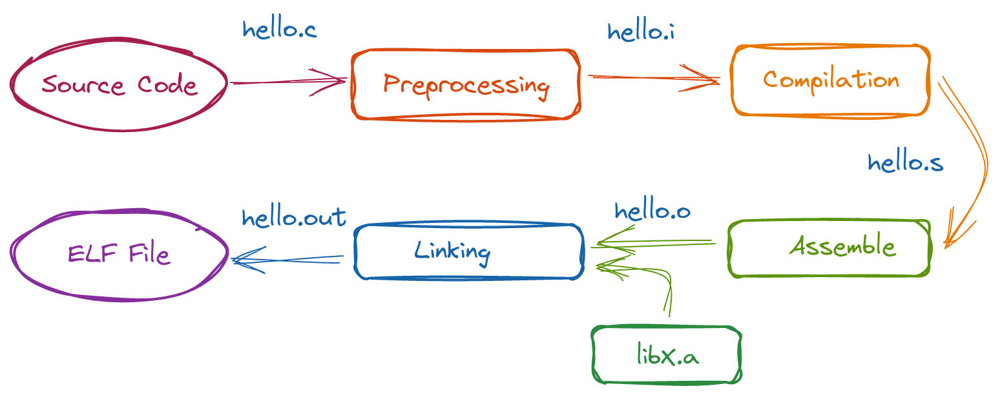

# RISC-V GCC

XiaoXuan Assembly 使用编译工具 [RISC-V GCC](https://github.com/riscv-collab/riscv-gnu-toolchain) 来对比编译、汇编和链接的结果，下面简单介绍 RISC-V GCC 的使用方法。

<!-- @import "[TOC]" {cmd="toc" depthFrom=2 depthTo=6 orderedList=false} -->

<!-- code_chunk_output -->

- [RISC-V 的编译工具](#risc-v-的编译工具)
- [QEMU 的工作模式](#qemu-的工作模式)
- [Hello world! 程序](#hello-world-程序)
  - [编译](#编译)
  - [可执行文件的主要内容](#可执行文件的主要内容)
  - [运行](#运行)
  - [分阶段编译](#分阶段编译)
  - [常用的参数](#常用的参数)
- ["裸机" 程序](#裸机-程序)
  - [打印单个字符的函数](#打印单个字符的函数)
  - [编译](#编译-1)
  - [打包目标文件](#打包目标文件)
  - [链接与运行](#链接与运行)
- [动态链接](#动态链接)

<!-- /code_chunk_output -->

## RISC-V 的编译工具

假设我们工作的平台是 x86_64 Linux，现在需要把程序编译成可以在 RISC-V 平台上运行的可执行文件，这种编译叫做 _交叉编译_。相对地，平常 _普通的编译_ 是在当前的平台里编译出给当前平台运行的软件。交叉编译本质上是生成 "可以在目标平台里顺利运行的二进制文件"，为了实现这个目标，编译器在生成二进制文件时，有几个基本的要素必须跟目标平台一致：指令集、内核（系统调用）、各种库的所在位置等。

RISC-V GCC 是一个常用的交叉编译工具，在大部分 Linux 发行版里，都可以通过包管理器安装。

注意在安装 RISC-V GCC 的时候，有可能会发现有两套名称相近的工具，比如在 Arch Linux 里，有 `riscv64-elf-*` 和 `riscv64-linux-gnu-*` 两套程序。前者用于编译 "裸机" 程序，即在 "无操作系统" 的环境里运行的程序，比如开发内核或者嵌入式程序。后者用于编译在 Linux 环境中运行的程序（POSIX 程序），也就是我们平常所接触到的程序。条件允许的话，建议两套工具都安装。技术来说，后者只不过会链接 C 的标准库，除此之外并没有太大的不同。因此有些环境不区分这两套程序，统一叫做 `riscv64-unknown-elf-*`。

## QEMU 的工作模式

对于裸机程序，我们使用 `qemu-system-riscv64` 来运行，这时 QEMU 会工作在 "全系统模拟" 模式中，它模拟了一个完整的计算机系统，包括 CPU、内存、磁盘等硬件，我们可以在这种模式下执行所有 CPU 指令。

对于 Linux 程序，因为这种程序一般包含系统调用等的代码，所以无法直接使用 `qemu-system-riscv64` 来运行，除非你把引导程序、内核、虚拟磁盘等通通都配置好了，它才能顺利运行。当然还有一个简单的方法，使用 QEMU 的 _用户模式模拟_ 程序 `qemu-riscv64` 来运行，这种模式会把你的程序转换为主机平台支持的程序（当然 _系统调用_ 也一起被转换），所以如果你写了一个向控制台打印 "Hello world" 的 RISC-V 程序，想让它跑起来的最简单的方法是使用 `riscv64-linux-gnu-gcc` 编译，然后使用 `qemu-riscv64` 来运行。

## Hello world! 程序

下面先从最简单的程序开始了解 RISC-V GCC。

### 编译

目录 [resources](./resources/) 里有一个 "Hello world!" 程序 `hello.c`，内容如下：

```c
#include <stdio.h>

int main() {
    printf("Hello world!\n");
    return 0;
}
```

因为这不是 "裸机" 程序，因此需要使用 `riscv64-linux-gnu-gcc` 来编译：

`$ riscv64-linux-gnu-gcc -g -Wall -o hello.out hello.c`

- 参数 `-g` 用于生成供 GDB 使用的额外调试信息；
- 参数 `-Wall` 用于报告编译过程中的所有警告和错误信息；
- 参数 `-o hello.out` 用于指定输出的文件的名称，如果缺省这个参数，默认的输出文件名为 `a.out`，因为我们后续还有其它程序需要编译，所以为了避免混淆，这里需要指定输出文件名。

编译完成后得到文件 `hello.out`，使用 `file` 命令可以查看该文件的格式：

`$ file hello.out`

输出结果如下：

```text
hello.out: ELF 64-bit LSB pie executable, UCB RISC-V, RVC, double-float ABI, version 1 (SYSV), dynamically linked, interpreter /lib/ld-linux-riscv64-lp64d.so.1, BuildID[sha1]=156ee22d4c2f19bf333101d38249ce86c6a19d49, for GNU/Linux 4.15.0, with debug_info, not stripped
```

### 可执行文件的主要内容

我们重复上一章 [测试环境的安装和配置](../tesing-env-setup/README.zh-Hans.md) 所掌握的工具，首先查看程序的大小：

`$ riscv64-linux-gnu-size hello.out`

输出结果如下：

```text
   text    data     bss     dec     hex filename
   1123     584       8    1715     6b3 hello.out
```

根据上面的数值可知，编译器在我们的程序里额外塞入了不少信息，下面查看该 ELF 文件的详细信息：

`$ riscv64-linux-gnu-readelf -l hello.out`

输出的（部分）结果如下：

```text
Elf file type is DYN (Position-Independent Executable file)
Entry point 0x5b0
There are 10 program headers, starting at offset 64

Program Headers:
  Type           Offset             VirtAddr           PhysAddr
                 FileSiz            MemSiz              Flags  Align
  LOAD           0x0000000000000000 0x0000000000000000 0x0000000000000000
                 0x00000000000006e4 0x00000000000006e4  R E    0x1000
  LOAD           0x0000000000000e08 0x0000000000001e08 0x0000000000001e08
                 0x0000000000000248 0x0000000000000250  RW     0x1000

 Section to Segment mapping:
  Segment Sections...
   03     .interp .note.gnu.build-id .note.ABI-tag .gnu.hash .dynsym .dynstr .gnu.version .gnu.version_r .rela.dyn .rela.plt .plt .text .rodata .eh_frame_hdr .eh_frame
   04     .preinit_array .init_array .fini_array .dynamic .data .got .bss
```

可见有两个 program header 将会被加载进内存，其中第一段具有 "read, execute" 标记，第二段有 "read, write" 标记，同时得知程序的入口位于 `0x5b0`。

下面再反汇编其中的代码段，查看位置 `0x5b0` 的内容：

`$ riscv64-linux-gnu-objdump -d hello.out`

输出（部分）结果如下：

```text
Disassembly of section .text:

...
00000000000005b0 <_start>:
 5b0:   022000ef                jal     ra,5d2 <load_gp>
 5b4:   87aa                    mv      a5,a0
 5b6:   00002517                auipc   a0,0x2
 5ba:   a8253503                ld      a0,-1406(a0) # 2038 <_GLOBAL_OFFSET_TABLE_+0x10>
 5be:   6582                    ld      a1,0(sp)
 5c0:   0030                    addi    a2,sp,8
 5c2:   ff017113                andi    sp,sp,-16
 5c6:   4681                    li      a3,0
 5c8:   4701                    li      a4,0
 5ca:   880a                    mv      a6,sp
 5cc:   fc5ff0ef                jal     ra,590 <__libc_start_main@plt>
 5d0:   9002                    ebreak
```

跟我们预想不同的是，程序的入口（即最先开始执行的指令）并不是 `main` 函数，而是一个名为 `_start` 的过程，该过程会设置 `global pointer` 寄存器的值，然后调用 `__libc_start_main@plt` 对 `GLOBAL_OFFSET_TABLE` 等进行一系列初始化工作。

> 关于 GOT（`GLOBAL_OFFSET_TABLE`）的详细信息请参阅本项目的另一篇文章 [动态调用](../dynamic-linking/README.zh-Hans.md)

而 `main` 函数的内容如下：

```text
0000000000000668 <main>:
 668:   1141                    addi    sp,sp,-16
 66a:   e406                    sd      ra,8(sp)
 66c:   e022                    sd      s0,0(sp)
 66e:   0800                    addi    s0,sp,16
 670:   00000517                auipc   a0,0x0
 674:   02050513                addi    a0,a0,32 # 690 <_IO_stdin_used+0x8>
 678:   f29ff0ef                jal     ra,5a0 <puts@plt>
 67c:   0001                    nop
 67e:   60a2                    ld      ra,8(sp)
 680:   6402                    ld      s0,0(sp)
 682:   0141                    addi    sp,sp,16
 684:   8082                    ret
```

可见它是一个普通的函数，有 _开场白_ 和 _收场白_ 模板代码，然后中间是对函数 `puts` 的调用。

### 运行

因为 `hello.out` 不是 "裸机" 程序，它依赖操作系统（系统调用）才能运行，所以我们可以使用 _用户模式_ 的 QEMU 模拟器 `qemu-riscv64` 来运行：

`$ qemu-riscv64 hello.out`

运行的结果是：

```text
qemu-riscv64: Could not open '/lib/ld-linux-riscv64-lp64d.so.1': No such file or directory
```

这是因为我们程序调用了 `printf` 函数，而这个函数实际上是调用了标准库的 `puts`，RISC-V GCC 默认使用了动态链接，所以在运行时会通过一个加载器尝试寻找该函数所在的库文件（以及函数的地址），然而不幸的是 `qemu-riscv64` 有时并不能正确地加载库。

> 虽然 _动态链接_ 对操作系统来说是不错的主意，但对于普通用户来说，应用程序因动态链接引起的问题实在令人头痛

河马蜀黍简单地试了几种方法均未成功解决该问题，因此下面我们尝试使用静态链接。

> 注意有些环境里的 RISC-V GCC 编译器默认使用静态链接。

我们可以在编译时传入 `-static` 参数，用于指示 GCC 使用静态链接，也就是说，把调用的外部函数的代码复制进我们的可执行文件里：

`$ riscv64-linux-gnu-gcc -static -o hello.static.out hello.c`

先看看文件格式：

`$ file hello.static.out`

输出结果：

```text
hello.static.out: ELF 64-bit LSB executable, UCB RISC-V, RVC, double-float ABI, version 1 (SYSV), statically linked, BuildID[sha1]=e5483614d4b600c22bdada95913a953eae577965, for GNU/Linux 4.15.0, with debug_info, not stripped
```

原先的 "dynamically linked" 已经变为 "statically linked"。再看看文件的大小：

`$ riscv64-linux-gnu-size hello.static.out`

输出结果如下：

```text
   text    data     bss     dec     hex filename
 387532   22024   21760  431316   694d4 hello.static.out
```

代码段的大小从 1KB 多增长到近 400KB，这是因为链接器把所用到的（位于标准库里头的）函数的代码都复制过来了，如果反汇编 `hello.static.out` 将会得到超长的文本，因此这里就略过了，下面我们运行这个静态链接的可执行文件：

`$ qemu-riscv64 hello.static.out`

这次得到我们预期的结果了：

```text
Hello world!
```

### 分阶段编译

当我们执行命令 `riscv64-linux-gnu-gcc` 将一个 C 源文件编译为一个可执行文件时，实际上 GCC 在背后是分 4 个阶段来完成的：



1. 预处理
   将源代码里的 `include` 文件包含进来，解析其中的条件编译指令（`#ifdef`），展开宏（`macro`）等各种预处理指令。相当于如下命令：

   `$ riscv64-linux-gnu-cpp hello.c > hello.i`

   或者

   `$ riscv64-linux-gnu-gcc -E hello.c > hello.i`

2. 编译
   将 C 代码编译为汇编代码，相当于如下命令：

   `$ riscv64-linux-gnu-gcc -S hello.i`

3. 汇编
   将汇编代码转换为机器指令，并生成目标文件，相当于如下命令：

   `$ riscv64-linux-gnu-as -o hello.o hello.s`

   第 1 到第 3 步也可以一步完成：

   `$ riscv64-linux-gnu-gcc -c -o hello.o hello.c`

   参数 `-c` 表示只编译（包括汇编）但不链接。

4. 链接
   将多个目标文件（假如有的话）链接起来，并重新定位其中的函数地址，最后生成 ELF 格式的可执行文件，相当于命令：

   `$ riscv64-linux-gnu-ld -o hello.stage.out -e main -lc hello.o`

   其中：
   - 参数 `-e main` 用来指定入口函数
   - 参数 `-lc` 表明需要链接库 `libc.so`

   最后我们得到可执行文件 `hello.stage.out`，不过由于 `qemu-riscv64` 未能加载动态库，所以为了成功运行，改用下面的命令静态链接：

   `$ riscv64-linux-gnu-gcc -o hello.stage.static.out -static hello.o`

   运行该可执行文件：

   `$ qemu-riscv64 hello.stage.static.out`

   输出了正确的结果 "Hello world!"。

### 常用的参数

- `-I` 用于指定头文件的路径
  有时头文件分布在多个位置，这时可以用参数 `-I` 把额外的头文件路径包含进来，比如当前的路径为 `/home/yang/hello-world/hello.c`，假如有额外的头文件位于 `/home/yang/include`，则可以这样传入参数：

  `$ riscv64-linux-gnu-gcc -I /home/yang/include hello.c`

- `-L` 和 `-l` 用于指定额外库的路径和名称
  接着上一个例子，如果我们的程序需要使用到库 `/home/yang/lib/libmymath.a`，则可以这样传入参数：

  `$ riscv64-linux-gnu-gcc -L /home/yang/lib -lmymath hello.c`

  其中参数 `-lmymath` 的 `-l` 是参数名称，`mymath` 是参数值。这个参数表示编译过程会使用到库文件 `libmymath.a`。注意库名称 `mymath` 必须去除了前缀 `lib` 和后缀 `.a`（或者 `.so`），比如 `libm.so` 的库名是单独一个字母 `m`，`libpthread.so` 的库名是 `pthread`。

GCC 的编译过程是松散的，它由上一节所述的 4 个相对独立的过程组成，显然头文件是在预处理阶段使用，而库文件则是在链接阶段使用。另外每个源代码文件都是单独编译，只有在链接阶段才被合并在一起，理解这些概念有助于解决在编译过程遇到的各种问题。

## "裸机" 程序

"裸机" 程序虽然运行在 "无操作系统" 的环境中，但数值计算、流程控制、程序的结构等跟普通应用程序是一样的，只是在进行 I/O 操作时，需要直接跟硬件打交道。

幸好跟硬件打交道也不算太复杂：有些硬件在电路里被映射到某段内存地址，比如串口控制台、键盘、VGA 文本等，你只需把它们当作内存的数据来读写，即可获取这些硬件的状态数据或者更改它们的状态；另外有些硬件有专门的 CPU 指令来操作，我们只需编写相应的汇编代码即可。

下面是一个 "裸机" 版的 "Hello world!" 程序，该程序实现 3 个功能：

1. 向串口控制台打印一行 "Hello world!" 文本；
2. 计算两个整数的和并显示其结果；
3. 计算一个整数加上 10 之后的值，并显示其结果；

因为没有操作系统的支持，显然我们无法直接使用 `printf` 函数，但我们可以编写一个功能相近的简单函数。

### 打印单个字符的函数

我们的程序准备在虚拟机 QEMU RISC-V virt 中运行，通过查看 [QEMU RISC-V virt 的源代码](https://github.com/qemu/qemu/blob/master/hw/riscv/virt.c) 可以找到一些基本硬件的内存映射关系：

```c
static const MemMapEntry virt_memmap[] = {
    [VIRT_MROM] =         {     0x1000,        0xf000 },
    ...
    [VIRT_UART0] =        { 0x10000000,         0x100 },
    ...
    [VIRT_FLASH] =        { 0x20000000,     0x4000000 },
    ...
    [VIRT_DRAM] =         { 0x80000000,           0x0 },
};
```

其中串口通信 UART 被映射到 `0x1000_0000`，只需向该内存地址写入一个 byte 类型整数，该整数对应的 ASCII 字符就会被重定向到我们的虚拟终端。所以要实现打印单个字符的函数是很简单的，在目录 [resources](./resources/) 有源代码 `put_char.S`，其内容如下：

```S
.section .text.put_char

.globl put_char

put_char:
    li s1, 0x10000000
    mv s2, a0
    sb s2, 0(s1)
    ret
```

在此基础之上，我们可以用 C 语言实现 `print_char`，`print_string` 和 `print_int` 等函数，以方便我们调用。源代码位于 `libprint.c`，其内容如下：

```c
#include "put_char.h"

void print_char(char c)
{
    put_char((unsigned int)c);
}

void print_string(const char *str)
{
    while (*str != '\0')
    {
        print_char(*str);
        str++;
    }
}

void print_int(int i)
{
    char s[21];
    itoa(i, s, 21);
    print_string(s);
}
```

至此，我们就已经有打印字符、字符串和数字的能力了。接下来实现整数相加等数学函数，源代码分别位于 `liba.c` 和 `libb.c`，其内容如下：

```c
// liba.c
int add(int a, int b)
{
    return a + b;
}

// libb.c
#include "a.h"

int add10(int i)
{
    return add(i, 10);
}
```

> 之所以把函数划分到两个文件，是因为接下来的章节会讲述 _打包目标文件_ 的功能，即把 `liba.o` 和 `libb.o` 打包为 `libmath.a`

然后再看看主程序，源代码位于 `app.c`，其内容如下：

```c
#include "math.h"
#include "print.h"

void mymain()
{
    int a = 3;
    int b = 5;
    int m = add(a, b);
    int n = add10(a);

    print_string("Hello world!\n");
    print_int(m);
    print_char('\n');
    print_int(n);
    print_char('\n');
}
```

因为这个是 "裸机" 程序，为了跟标准程序区分，这里把主函数 `main` 命名为 `mymain`（随意的名称）。

由上一节我们知道，可执行文件的入口（即最先开始执行的指令）是由编译器自动生成的 `_start` 过程，经过一系列初始化之后才调用那个 _约定俗成_ 的主函数 `main`，但这些事情仅在编译为标准 Linux 程序时才会发生。现在我们编译 "裸机" 程序，编译器是不会自作主张地帮我们添加这些过程的，所以我们还得写一个 "程序的引导程序"，源代码位于 `app-loader.S`，其内容如下：

```S
.section .text.entry
.globl _start

_start:
    la sp, stack_top
    call mymain

_loop:
    nop
    j _loop
```

"程序的引导程序" 的功能很简单：

1. 因为我们的程序有嵌套的函数调用，所以需要用到 _栈_。通过向 "stack pointer" 寄存器写入数值，即可设置栈底（高地址），这样一来我们的 _栈_ 就搭建好了。（代码中的 `stack_top` 是链接脚本 `app.lds` 导出的符号）
2. 调用主程序的主函数 `mymain`。

### 编译

编译各个源文件，但暂时不链接。编译的命令这里就不再赘述了，命令如下：

```bash
$ riscv64-elf-as -o app-loader.o app-loader.S
$ riscv64-elf-as -o put_char.o put_char.S
$ riscv64-elf-gcc -I . -Wall -fPIC -c -o libprint.o libprint.c
$ riscv64-elf-gcc -I . -Wall -fPIC -c -o liba.o liba.c
$ riscv64-elf-gcc -I . -Wall -fPIC -c -o libb.o libb.c
$ riscv64-elf-gcc -I . -Wall -fPIC -c -o app.o app.c
```

对于那个编译 `app.c` 的命令可能会感到疑惑，因为 `app.c` 需要用到库 `libmath.a`，而目前我们还不存在这个库，为什么也能成功编译呢？

这正是上一章节提到的，在编译一个源文件时，如果代码里有调用外部函数，编译器实际上不管这个外部函数是否存在，它只需你提供这个函数的签名即可（函数签名位于 `math.h`），这也是为什么各个源文件可以各自单独编译的原因。

### 打包目标文件

我们可以打包多个目标文件以形成一个库文件，这样可以方便以后使用。使用下面的命令将 `liba.o` 和 `libb.o` 打包为 `libmath.a`：

`$ riscv64-elf-ar -cr libmath.a liba.o libb.o`

命令运行之后将得到包文件 `libmath.a`（一般称为 _静态库_）。程序 `riscv64-elf-ar` 除了可以创建包文件，还可以查看或者修改包文件，比如下面的命令用于查看包文件里含有哪些目标文件：

`$ riscv64-elf-ar -t libmath.a`

输出结果如下：

```text
liba.o
libb.o
```

包文件也能够使用 `riscv64-elf-nm` 程序列出符号列表：

`$ riscv64-elf-nm libmath.a`

输出结果如下：

```text
liba.o:
0000000000000000 T add

libb.o:
                 U add
0000000000000000 T add10
```

当然也能用 `riscv64-elf-objdump` 反汇编包文件：

`$ riscv64-elf-objdump -d libmath.a`

输出（部分）结果如下：

```text
In archive libmath.a:

liba.o:     file format elf64-littleriscv
Disassembly of section .text:

0000000000000000 <add>:
   0:   1101                    addi    sp,sp,-32
...
  26:   6105                    addi    sp,sp,32
  28:   8082                    ret

libb.o:     file format elf64-littleriscv
Disassembly of section .text:

0000000000000000 <add10>:
   0:   1101                    addi    sp,sp,-32
...
  26:   6105                    addi    sp,sp,32
  28:   8082                    ret
```

通过反汇编会发现，包文件（即静态库）仅仅是把原先的多个目标文件 **原样** 合并起来，其中的内容均未改变。这跟链接程序把多个目标文件链接起来的情况不同，链接程序会修改部分内容（比如会解决各个符号的地址）。

### 链接与运行

下面将 `app-loader.o`，`app.o`，`libmath.a`，`libprint.o` 和 `put_char.o` 链接起来：

`$ riscv64-elf-ld -T app.lds -o app.out app-loader.o app.o libmath.a libprint.o put_char.o`

- 参数 `-T app.lds` 表示使用指定的链接脚本 `app.lds` 来链接目标文件，有关链接脚本的具体内容可以参阅 [Linker Scripts](https://sourceware.org/binutils/docs/ld/Scripts.html) 或者 [中文翻译版](https://blog.csdn.net/m0_47799526/article/details/108765403) 。
- 参数 `-o app.out` 指示输出的文件名。
- 参数 `app-loader.o app.o libmath.a libprint.o put_char.o` 表示待链接的文件列表。其中 `libmath.a` 是包文件，可见其实包文件可以简化我们的命令（假设包文件由非常多的目标文件组成的话）。

命令运行之后得到 ELF 格式的可执行文件 `app.out`，下面使用 "QEMU 全系统模拟" 的模式运行该文件：

```bash
$ qemu-system-riscv64 \
    -machine virt \
    -nographic \
    -bios none \
    -kernel app.out
```

如无意外，应该能看到正确的输出结果：

```text
Hello world!
8
13
```

按 `Ctrl+a`，再按 `x` 结束 QEMU 模拟程序。

## 动态链接

平常我们会把通用的库做成 _共享库_（也叫 _动态库_，或者 _动态共享目标文件_ 即 DSO），让应用程序在运行阶段 "动态" 地找到我们的库然后调用其中的函数。在编译应用程序时，如果准备采用共享库的工作方式，则可以称该应用程序用了动态链接技术。

动态链接有几个主要的优点：

1. 对比静态链接，使用动态链接可以减小可执行文件的容量。想象一下如果有一个极为通用的函数库，如果使用静态链接的话，则每个应用程序都需要复制一遍它使用到的函数的代码。而使用动态链接的话，应用程序只需指明需要的库的名称和函数名即可。

2. 可以解耦应用程序和共享库。如果在发布应用程序后发现库里面有 bug，我们可以只修复和重新发布该库即可，而不需要重新编译和发布应用程序。

3. 能加速应用程序的加载速度和减少内存使用量。如果有多个应用程序都使用到同一个共享库，则操作系统在运行这些应用程序时，只需加载一次共享库即可。

当然动态链接也有不少缺点，比如在 Linux 环境里，因为动态库的路径问题而导致应用程序运行失败的例子比比皆是，在这里我们不深入探讨。不过动态链接是非常常用的技术，所以我们还是有必要了解如何生成和使用动态库，以及它的工作原理。

> 因为 RISC-V GCC 在链接共享库以及运行动态链接程序时支持得不太稳定，所以下面的内容是在 x86_64 Linux GCC 平台下操作的。

### 编译

跟上一节的例子相似，这次的程序由 `liba.c`，`libb.c` 以及 `app.x64.c` 组成，另外还有头文件 `a.h`，`b.h` 和 `math.h`。

首先分开编译（但不链接）各个源文件：

```bash
$ gcc -I . -Wall -fPIC -c -o liba.x86.o liba.c
$ gcc -I . -Wall -fPIC -c -o libb.x86.o libb.c
$ gcc -I . -Wall -fPIC -c -o app.x86.o app.x86.c
```

由上面的命令可见，使用 GCC 进行普通编译和交叉编译的步骤是一样的，不同的是各个工具名称再也不需诸如 `riscv64-elf-*` 之类的前缀。

我们先查看一下文件格式：

`$ file app.x86.o`

输出结果如下：

```text
app.x86.o: ELF 64-bit LSB relocatable, x86-64, version 1 (SYSV), not stripped
```

可以确认编译出的目标文件是 x86 架构。

### 生成共享库

生成共享库的方法跟生成静态库（包文件）有些类似，不过使用的是 `gcc` 程序而不是 `ar`，下面的命令用于将 `liba.x86.o` 和 `libb.x86.o` 合并为 `libmath.so`：

`$ gcc -shared -o libmath.x86.so liba.x86.o libb.x86.o`

参数：

- `-shared` 表示生成共享库而不是可执行文件。
- `-o libmath.x86.so` 指定输出的文件名。

命令运行完成后我们得到共享库文件 `libmath.x86.so`，下面查看它的符号表：

`$ nm libmath.x86.so`

输出的（部分）结果如下：

```text
0000000000001109 T add
000000000000111d T add10
```

可见 liba 和 libb 里面的两个函数都被包含进去了。

### 使用共享库

程序 `app.x86.c` 的源码如下：

```c
#include <stdio.h>
#include "math.h"

int main()
{
    int a = 3;
    int b = 5;
    int m = add(a, b);
    int n = add10(a);

    printf("Hello world!\n");
    printf("m=%d\n", m);
    printf("n=%d\n", n);
}
```

程序非常简单，只是简单地调用 `add` 和 `add10` 两个函数，从前面的章节我们知道，编译这个程序时，可以使用静态链接的方法把 `liba.x86.o` 和 `libb.x86.o` 的两个函数的代码（二进制指令）复制到最终程序里。在运行程序时，并不需要这些中间步骤生成的目标文件。

下面我们使用动态链接的方法生成可执行文件 `app.x86.out`：

`$ gcc -Wall -o app.x86.out app.x86.o libmath.x86.so`

上面的命令把 `libmath.x86.so` 作为输入文件的其中一员，这种写法跟静态链接类似。但动态链接命令的更常见写法如下：

`$ gcc -Wall -L . -l math.x86 -o app.x86.out app.x86.o`

参数：

- `-L .` 表示将当前目录也作为 `LD_LIBRARY_PATH` 的一部分，环境变量 `LD_LIBRARY_PATH` 是一个用冒号分隔的一系列路径（形式跟环境变量 `PATH` 一样），用于指示链接器从这些位置搜索链接所需的共享库（是不是跟 Java 当中的 `CLASSPATH` 有点相像？），你可以反复传入多个 `-L ???` 参数用于指定多个路径。
- `-l math.x86` 表示我们的程序会使用到名称为 `math.x86` 这个库，而链接器将会在库名称加上前缀 `lib` 和后缀 `.so` 得到文件名 `libmath.x86.so`，然后在 `LD_LIBRARY_PATH` 里搜索有无匹配的文件。

程序运行完成之后得到可执行文件 `app.x86.out`，下面运行这个文件：

`$ app.x86.out`

可惜程序并没有像预料那种顺利运行，它会报告错误：

```text
./app.x86.out: error while loading shared libraries: libmath.x86.so: cannot open shared object file: No such file or directory
```

消息提示找不到共享库文件 `libmath.x86.so`，你可能会很惊讶，这个文件不正躺在文件 `app.x86.out` 的旁边吗？对于有使用 Windows 系统经验的人来说可能更惊讶，在 Windows 里只需把缺少的 DLL 文件复制到跟 EXE 文件同一个目录里就能简单解决找不到共享库的问题。

然后 Linux 系统并不会从可执行文件所在的目录，或者某个叫 `lib` 的子目录里搜索共享库文件，它只会搜索默认的路径 `/usr/lib` 以及在 `/etc/ld.so.conf`（或者 `/etc/ld.so.conf.d/*.conf`）列出的目录。可以使用 `ldd` 命令检查一个可执行文件依赖哪些共享库：

`$ ldd app.x86.out`

输出的结果如下：

```text
        linux-vdso.so.1 (0x00007ffe24dfb000)
        libmath.x86.so => not found
        libc.so.6 => /usr/lib/libc.so.6 (0x00007f48d3564000)
        /lib64/ld-linux-x86-64.so.2 => /usr/lib64/ld-linux-x86-64.so.2 (0x00007f48d37a3000)
```

可以看到其中有一行写着 `libmath.x86.so => not found`，这表示程序将会找不到 `libmath.x86.so`。

为了让 `app.x86.out` 能成功运行，可以把共享库文件 `libmath.x86.so` 复制到 `/usr/lib`，或者把共享库所在的目录加入到 `/etc/ld.so.conf`。

```bash
echo `pwd` | sudo tee /etc/ld.so.conf.d/mylib.conf > /dev/null
sudo ldconfig
```

上面的第一条命令是将我们的共享库路径加入到 `/etc/ld.so.conf.d/mylib.conf`，第二条命令是刷新共享库路径的缓存。完成这两步之后就可以运行程序 `app.x86.out` 了：

`$ ./app.x86.out`

输出结果如下：

```text
Hello world!
m=8
n=13
```

再次使用 `ldd` 检查程序的共享库：

`$ ldd app.x86.out`

输出的结果如下：

```text
        linux-vdso.so.1 (0x00007ffd19bbc000)
        libmath.x86.so => /home/yang/projects/xiaoxuan-assembly-riscv/docs/risc-v-gcc/resources/libmath.x86.so (0x00007f4607a74000)
        libc.so.6 => /usr/lib/libc.so.6 (0x00007f460788d000)
        /lib64/ld-linux-x86-64.so.2 => /usr/lib64/ld-linux-x86-64.so.2 (0x00007f4607ad1000)
```

有时我们仅想测试一下程序，或者不希望更改系统的配置（比如复制文件到 `/usr/lib` 或者修改 `/etc/ld.so.conf`），还可以通过设置环境变量 `LD_LIBRARY_PATH` 来让程序顺利运行：

`$ LD_LIBRARY_PATH=. ./app.x86.out`

记得运行上面命令之前要先删除文件 `/etc/ld.so.conf.d/mylib.conf` 并且执行 `ldconfig` 命令以刷新共享库路径的缓存。

### 动态链接的原理

TODO::